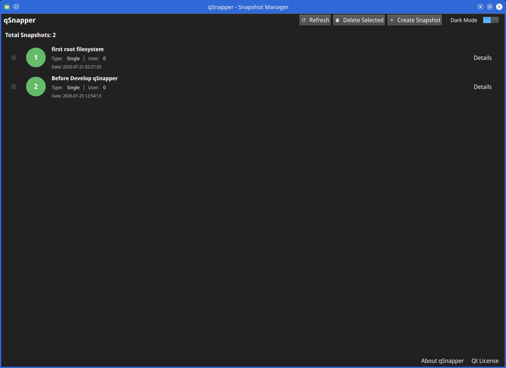
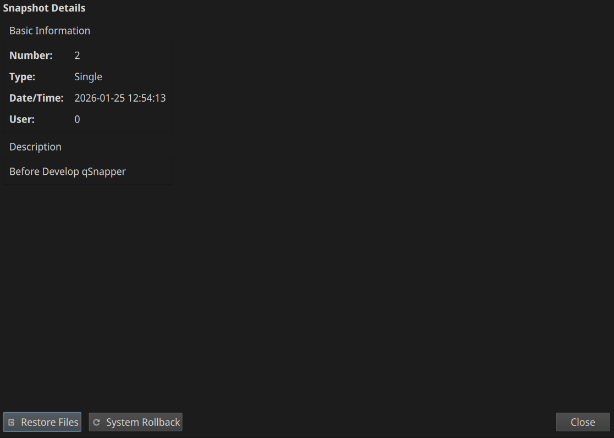
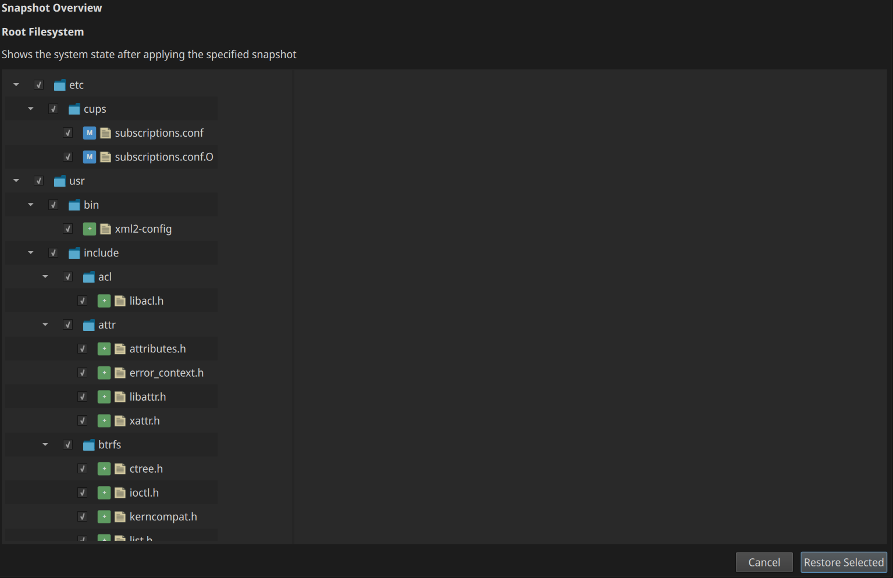
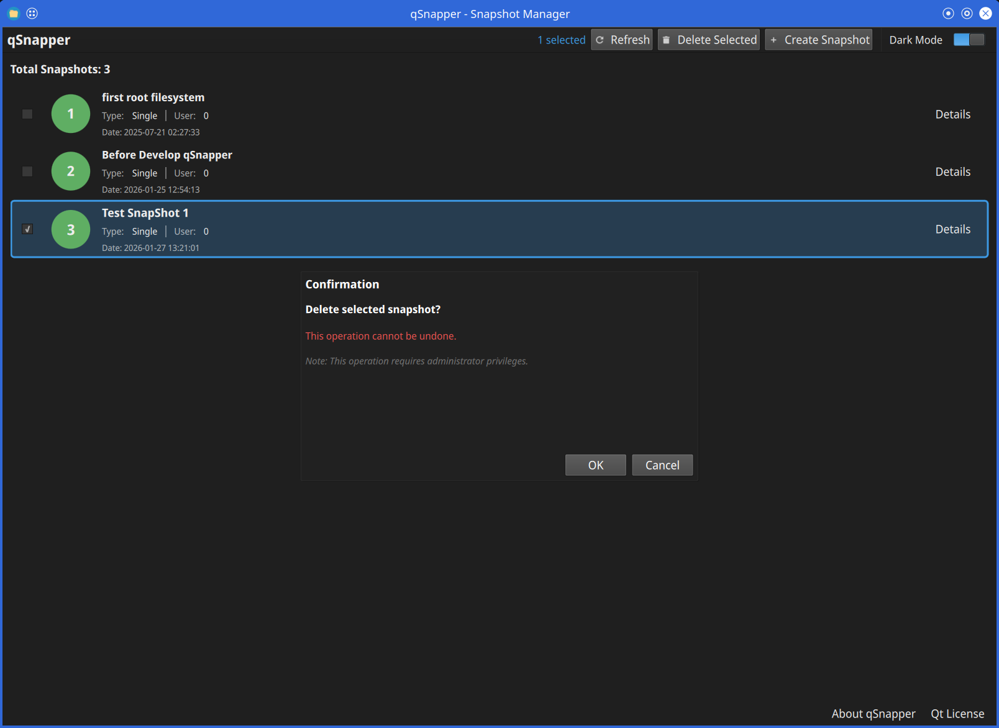

# qSnapper

A modern Qt6/QML GUI application for managing Btrfs/Snapper filesystem snapshots on Linux.


## Overview

qSnapper is a graphical user interface for the Snapper snapshot management tool. It provides an intuitive way to create, browse, and manage filesystem snapshots on Btrfs and other supported filesystems.

### Features

- **Snapshot Management**:  
  Create, view, and delete filesystem snapshots  
- **Snapshot Types**:  
  Support for Single, Pre, and Post snapshots  
- **Cleanup Policies**:  
  Configure automatic cleanup using Number or Timeline algorithms  
- **File Comparison**:  
  View changes between snapshots with detailed diff preview  
- **Restore Preview**:  
  Preview files before restoring from snapshots  
- **Theme Support**:  
  Light/Dark mode switching  
- **Internationalization**:  
  Multi-language support (English, Japanese)  
- **Modern UI**:  
  Built with Qt6 Quick/QML for a responsive user experience  
- **Secure Operations**:  
  Uses D-Bus and PolicyKit for privilege escalation  

## Screenshots

### Main Window - Snapshot List

The main window displays all available snapshots with detailed information including snapshot number, type, timestamp, and description.  

  

### Create Snapshot Dialog

Create new snapshots with customizable options including snapshot type (Single/Pre/Post),  
description, and cleanup algorithm.  

  

### Snapshot Detail Dialog

View detailed information about a specific snapshot,  
including file changes, metadata, and available actions.  

  

### Restore Preview Dialog

Preview file changes before restoring from a snapshot.  
This helps you understand what will be modified.  



### Delete Snapshot Dialog

Confirm snapshot deletion with a safety dialog that shows which snapshot will be removed.  



## Requirements

### Runtime Dependencies

- Linux operating system (required)
- Qt6 (>= 6.2)
  - Qt6 Core
  - Qt6 GUI
  - Qt6 Quick
  - Qt6 Qml
  - Qt6 DBus
- Snapper (>= 0.8.0)
- PolicyKit (polkit)
- D-Bus

### Build Dependencies

- CMake (>= 3.16)
- C++17 compatible compiler (GCC, Clang)
- Qt6 development packages
- PolicyKit-Qt6 development files
- Snapper development headers

## Installation

### From Source

#### 1. Install Dependencies

**openSUSE Leap 16 / SUSE Linux Enterprise 16**  

```bash
sudo zypper install cmake gcc-c++ \
                    qt6-base-devel qt6-declarative-devel qt6-linguist-devel \
                    polkit-devel libpolkit-qt6-1-devel \
                    libsnapper-devel
```

**RHEL 9 / 10**

```bash
sudo dnf install cmake gcc-c++ \
                 qt6-qtbase-devel qt6-qtdeclarative-devel qt6-linguist-devel \
                 polkit-devel polkit-qt6-1-devel \
                 snapper-devel
```

#### 2. Build and Install

```bash
git clone https://github.com/presire/qSnapper.git
cd qSnapper
mkdir build && cd build

cmake -DCMAKE_INSTALL_PREFIX=/usr ..
make -j$(nproc)
sudo make install
```

**Build Options:**  

- **SELinux Support** (Optional, disabled by default):
  ```bash
  cmake -DCMAKE_INSTALL_PREFIX=/usr -DENABLE_SELINUX=ON ..
  ```

  Enables SELinux Mandatory Access Control (MAC) policy module installation.

  **Requirements for SELinux:**
  - openSUSE / SUSE Linux Enterprise:
    ```bash
    sudo zypper install selinux-policy-devel policycoreutils
    ```
  - RHEL 9 / 10:
    ```bash
    sudo dnf install selinux-policy-devel policycoreutils-python-utils
    ```

  See [selinux/README.md](selinux/README.md) for detailed SELinux configuration.

- **Log Directory** (Optional, default: `/var/log/qsnapper`):
  ```bash
  cmake -DCMAKE_INSTALL_PREFIX=/usr -DQSNAPPER_LOG_DIR=/path/to/log/dir ..
  ```

  Changes the directory where the D-Bus service writes log files.
  The log filename (`qsnapper-dbus.log`) cannot be changed.
  If not specified, logs are written to `/var/log/qsnapper`.

#### 3. Post-Installation Steps

The installation process automatically installs:  
- D-Bus service files to `/usr/share/dbus-1/system-services/`
- D-Bus configuration to `/usr/share/dbus-1/system.d/`
- PolicyKit policy to `/usr/share/polkit-1/actions/`
- Desktop entry to `/usr/share/applications/`
- Application icon to `/usr/share/icons/hicolor/128x128/apps/`

Reload D-Bus and PolicyKit:  

```bash
sudo systemctl reload dbus
```

## Usage

### Launching qSnapper

You can launch qSnapper from:  
- Application menu (System Tools category)
- Command line: `qsnapper`

### Creating Snapshots

1. Click the "Create Snapshot" button
2. Select snapshot type (Single, Pre, or Post)
3. Enter a description
4. Choose cleanup algorithm (optional)
5. Click "Create"

### Viewing Snapshots

The main window displays a list of all snapshots with:  
- Snapshot number
- Type (Single, Pre, Post)
- Date and time
- User who created it
- Description

### Comparing Snapshots

Select a snapshot to view:  
- Files that were added, modified, or deleted
- Detailed file differences

### Restoring from Snapshots

1. Select a snapshot
2. Click "Restore" or "Preview Changes"
3. Review the changes that will be made
4. Confirm the restoration

**Warning**:  
Restoring snapshots may overwrite current data. Always review changes before confirming.  

## Configuration

### Snapper Configuration

qSnapper uses your existing Snapper configuration.  
To configure Snapper for your root filesystem:  

```bash
sudo snapper -c root create-config /
```

For other filesystems:  

```bash
sudo snapper -c <config-name> create-config <mount-point>
```

### Application Settings

Application settings are stored in:  
- `~/.config/Presire/qSnapper.conf`

Settings include:  
- Theme mode (Light or Dark)
- Window geometry and state
- User preferences

### Theme Configuration

qSnapper supports theme switching through the built-in ThemeManager:  

1. **Light Mode**:  
   Optimized light color scheme with Material Design colors  
2. **Dark Mode**:  
   Comfortable dark color scheme for low-light environments  

The theme setting is automatically persisted in the application configuration and can be toggled through the UI.  

## Troubleshooting

### D-Bus Connection Errors

If you see D-Bus connection errors:  

1. Check if the D-Bus service file is installed:  
   
   ```bash
   ls /usr/share/dbus-1/system-services/com.presire.qsnapper.Operations.service
   ```

2. Verify D-Bus configuration:  
   
   ```bash
   ls /usr/share/dbus-1/system.d/com.presire.qsnapper.Operations.conf
   ```

3. Check D-Bus service status:  
   
   ```bash
   systemctl status dbus
   ```

### Permission Denied

If operations fail with permission errors:  

1. Verify PolicyKit policy is installed:  
   
   ```bash
   ls /usr/share/polkit-1/actions/com.presire.qsnapper.policy
   ```

2. Ensure your user is in the required groups (implementation-specific)  

### Snapper Not Configured

If Snapper is not configured:  
s
```bash
sudo snapper list-configs
```

If no configurations exist, create one as shown in the Configuration section.  

## Development

### Building for Development

```bash
mkdir build-debug && cd build-debug
cmake -DCMAKE_BUILD_TYPE=Debug ..
make -j$(nproc)
```

### Project Structure

```
qSnapper/
├── CMakeLists.txt             # Build configuration
├── src/                       # C++ source files
│   ├── main.cpp              # Application entry point
│   ├── fssnapshot.cpp        # Snapshot data model
│   ├── snapperservice.cpp    # Snapper service interface
│   ├── snapshotlistmodel.cpp # Snapshot list model
│   ├── filechangemodel.cpp   # File change tree model
│   ├── thememanager.cpp      # Theme management (Light/Dark mode)
│   └── dbusservice/          # D-Bus service implementation
│       ├── main.cpp          # D-Bus service entry point
│       └── snapshotoperations.cpp  # D-Bus method implementations
├── include/                  # Header files
├── qml/                      # QML user interface
│   ├── Main.qml             # Main window with theme support
│   ├── pages/               # Page components
│   │   └── SnapshotListPage.qml
│   └── components/          # Reusable components
│       ├── SnapshotItem.qml
│       ├── SnapshotDetailDialog.qml
│       ├── RestorePreviewDialog.qml
│       ├── AboutqSnapperDialog.qml
│       └── AboutQtDialog.qml
├── icons/                   # Application icons
├── dbus/                    # D-Bus configuration files
├── polkit/                  # PolicyKit policy files
└── translations/            # Translation files
    └── qsnapper_ja.ts      # Japanese translation
```

## Contributing

Contributions are welcome! Please feel free to submit issues and pull requests.  

### Guidelines

1. Follow the existing code style
2. Test your changes thoroughly
3. Update documentation as needed
4. Ensure all commits are signed

## License

This project is licensed under the GNU General Public License v3.0 or later - see the [LICENSE.md](LICENSE.md) file for details.  

## Acknowledgments

- [Snapper](http://snapper.io/) - The snapshot management tool
- [Qt Project](https://www.qt.io/) - The cross-platform framework
- [PolicyKit](https://www.freedesktop.org/software/polkit/) - Authorization framework

## Links

- GitHub Repository: https://github.com/presire/qSnapper
- Issue Tracker: https://github.com/presire/qSnapper/issues
- Snapper Documentation: http://snapper.io/documentation.html

## Author

**Presire**  
- GitHub: [@presire](https://github.com/presire)
