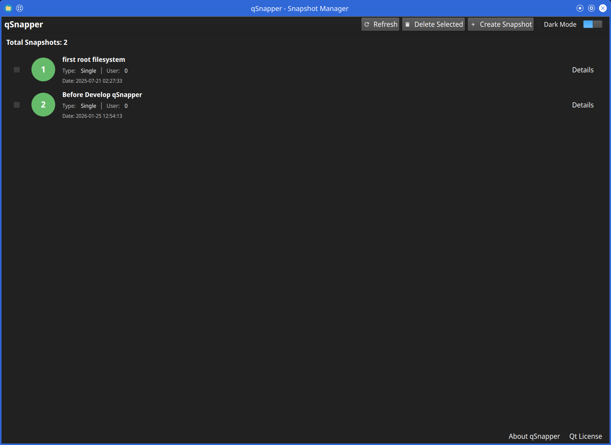
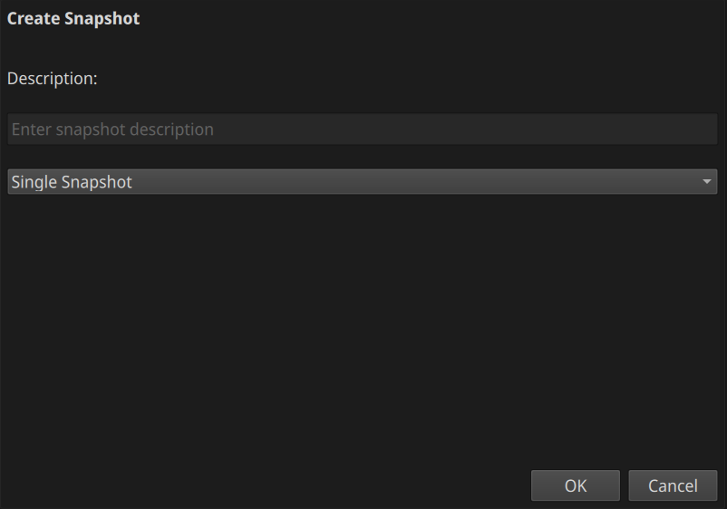
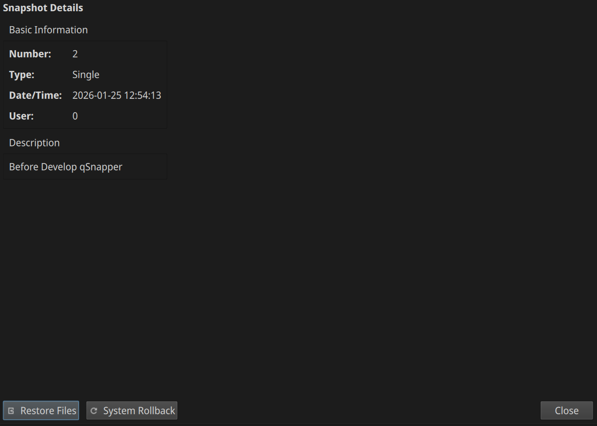
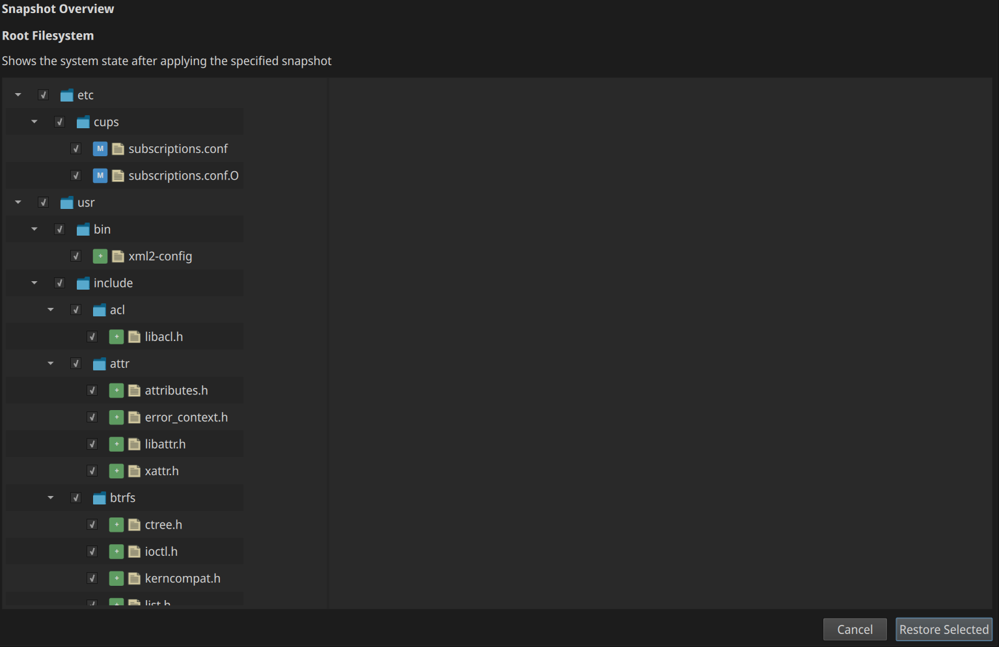
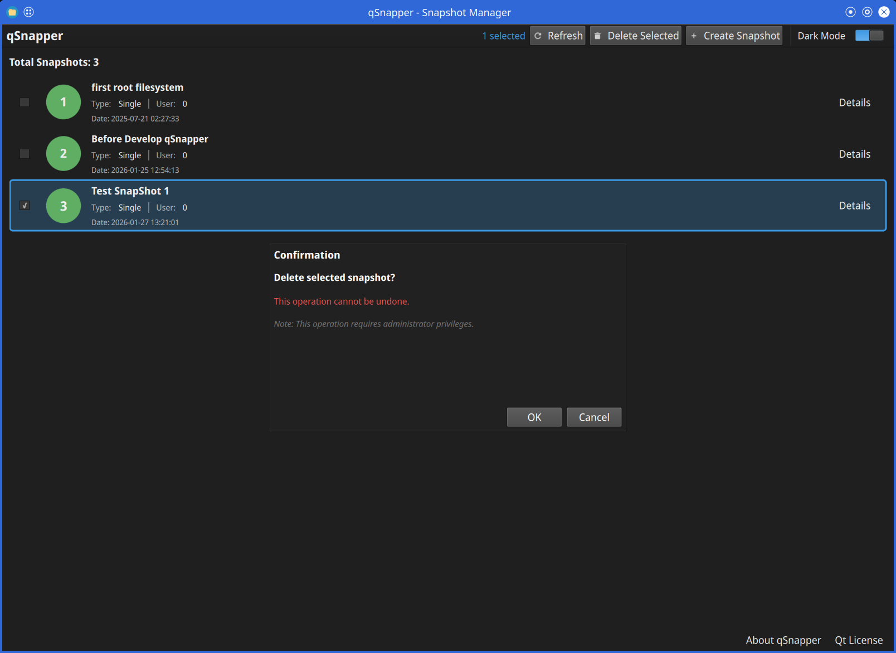

# qSnapper

A modern Qt6/QML GUI application for managing Btrfs/Snapper filesystem snapshots on Linux.


<p align="center">
  
  
</p>

## Overview

qSnapper is a graphical user interface for the Snapper snapshot management tool. It provides an intuitive way to create, browse, and manage filesystem snapshots on Btrfs and other supported filesystems.

### Features

- **Snapshot Management**:  
  Create, view, and delete filesystem snapshots  
- **Snapshot Types**:  
  Support for Single, Pre, and Post snapshots  
- **Cleanup Policies**:  
  Configure automatic cleanup using Number or Timeline algorithms  
- **File Comparison**:
  View changes between snapshots with detailed diff preview
- **Pre/Post Snapshot Comparison**:
  Choose between reverting to the Pre snapshot, re-applying to the Post snapshot, or viewing either snapshot against the current system. Restoring only touches files that changed between Pre and Post
- **Restore Preview**:
  Preview files before restoring from snapshots
- **Fast Restore**:
  Two restore modes — Direct Copy (fast, btrfs reflink-aware) and YaST compatible — with configurable batch size and real-time progress logging
- **Theme Support**:  
  Light/Dark mode switching  
- **Internationalization**:
  Multi-language support (English, Japanese, German)
- **Modern UI**:  
  Built with Qt6 Quick/QML for a responsive user experience  
- **Secure Operations**:  
  Uses D-Bus and PolicyKit for privilege escalation  

## Screenshots

### Main Window - Snapshot List

The main window displays all available snapshots with detailed information including snapshot number, type, timestamp, and description.  

<p align="center"></p>  

### Create Snapshot Dialog

Create new snapshots with customizable options including snapshot type (Single/Pre/Post),  
description, and cleanup algorithm.  

<p align="center"></p>  

### Snapshot Detail Dialog

View detailed information about a specific snapshot,  
including file changes, metadata, and available actions.  

<p align="center"></p>  

### Restore Preview Dialog

Preview file changes before restoring from a snapshot.  
This helps you understand what will be modified.  

<p align="center"></p>

### Restore Settings Dialog

Configure the restore method (Direct Copy or YaST compatible) and batch size before restoring files.  

<p align="center"></p>

### Delete Snapshot Dialog

Confirm snapshot deletion with a safety dialog that shows which snapshot will be removed.  

<p align="center"></p>

## Requirements

### Runtime Dependencies

- Linux operating system (required)
- Qt6 (>= 6.2)
  - Qt6 Core
  - Qt6 GUI
  - Qt6 Quick
  - Qt6 QuickControls2
  - Qt6 Qml
  - Qt6 DBus
- Snapper (>= 0.8.0)
- PolicyKit (polkit)
- D-Bus

### Build Dependencies

- CMake (>= 3.16)
- C++17 compatible compiler (GCC, Clang)
- Qt6 development packages
- PolicyKit-Qt6 development files
- Snapper development headers
- scdoc (optional, for generating the man page; if absent, the build skips man page generation)

## Installation

### From Source

#### 1. Install Dependencies

**openSUSE Leap 16 / SUSE Linux Enterprise 16**  

```bash
sudo zypper install cmake gcc-c++ \
                    qt6-base-devel qt6-declarative-devel qt6-quickcontrols2-devel qt6-linguist-devel \
                    polkit-devel libpolkit-qt6-1-devel \
                    libsnapper-devel libbtrfsutil-devel scdoc
```

**RHEL 9 / 10**  

```bash
sudo dnf install cmake gcc-c++ \
                 qt6-qtbase-devel qt6-qtdeclarative-devel qt6-qtquickcontrols2-devel qt6-linguist-devel \
                 polkit-devel polkit-qt6-1-devel \
                 snapper-devel btrfs-progs-devel scdoc
```

**Debian 13 (trixie)**  

```bash
sudo apt install cmake g++ make pkg-config \
                 qt6-base-dev qt6-declarative-dev qt6-tools-dev \
                 libpolkit-qt6-1-dev libpolkit-gobject-1-dev \
                 libsnapper-dev libboost-dev libbtrfs-dev libbtrfsutil-dev scdoc
```

**Note:**  
The D-Bus system service uses the polkit-gobject-1 API directly, and the build locates it via `pkg-config` (`polkit-gobject-1.pc`).  
This module is shipped in `polkit-devel` on openSUSE and RHEL/Fedora,  
and in `libpolkit-gobject-1-dev` on Debian (all listed above), so no additional package is required.  

#### 2. Build and Install

```bash
git clone https://github.com/presire/qSnapper.git
cd qSnapper
mkdir build && cd build

cmake -DCMAKE_INSTALL_PREFIX=/usr ..
make -j$(nproc)
sudo make install
```

**Build Options:**  

- **SELinux Support** (Optional, disabled by default):
  ```bash
  cmake -DCMAKE_INSTALL_PREFIX=/usr -DENABLE_SELINUX=ON ..
  ```

  Enables SELinux Mandatory Access Control (MAC) policy module installation.  

  **Requirements for SELinux:**  

  - openSUSE / SUSE Linux Enterprise:
    ```bash
    sudo zypper install selinux-policy-devel policycoreutils
    ```
  - RHEL 9 / 10:
    ```bash
    sudo dnf install selinux-policy-devel policycoreutils-python-utils
    ```

  See [selinux/README.md](selinux/README.md) for detailed SELinux configuration.

- **Log Directory** (Optional, default: `/var/log/qsnapper`):  
  ```bash
  cmake -DCMAKE_INSTALL_PREFIX=/usr -DQSNAPPER_LOG_DIR=/path/to/log/dir ..
  ```

  Changes the directory where the D-Bus service writes log files.  
  The log filename (`qsnapper-dbus.log`) cannot be changed.  
  If not specified, logs are written to `/var/log/qsnapper`.  

#### 3. Post-Installation Steps

The installation process automatically installs:  
- D-Bus service files to `/usr/share/dbus-1/system-services/`
- D-Bus configuration to `/usr/share/dbus-1/system.d/`
- PolicyKit policy to `/usr/share/polkit-1/actions/`
- Desktop entry to `/usr/share/applications/`
- Application icon to `/usr/share/icons/hicolor/128x128/apps/`
- Manual page to `/usr/share/man/man1/` (view with `man qsnapper`; only when scdoc is available at build time)

Reload D-Bus and PolicyKit:  

```bash
sudo systemctl reload dbus
```

## Usage

### Launching qSnapper

You can launch qSnapper from:  
- Application menu (System Tools category)
- Command line: `qsnapper`

### Creating Snapshots

1. Click the "Create Snapshot" button
2. Select snapshot type (Single, Pre, or Post)
3. Enter a description
4. Choose cleanup algorithm (optional)
5. Click "Create"

### Viewing Snapshots

The main window displays a list of all snapshots with:  
- Snapshot number
- Type (Single, Pre, Post)
- Date and time
- User who created it
- Description

### Comparing Snapshots

Select a snapshot to view:  
- Files that were added, modified, or deleted
- Detailed file differences

### Restoring from Snapshots

1. Select a snapshot
2. Click "Show Changes" to open the Snapshot Overview
3. Review the file changes in the tree view and diff panel
4. Check the files/directories you want to restore
5. Click "Restore Selected" to restore the checked items

For Pre/Post snapshot pairs, the Snapshot Overview offers four views:  
- **Revert to Pre #N**: undo the changes made between Pre #N and Post #M (restorable; this is the default view)  
- **Re-apply to Post #M**: redo the changes made between Pre #N and Post #M (restorable)  
- **Show differences between snapshot #N (Pre) and the current system**: view only  
- **Show differences between snapshot #M (Post) and the current system**: view only  

Checkboxes and the restore button are available only in the two restorable views. The two "vs current system" views are read-only and display the hint "View only. Choose a Pre / Post difference above to restore."  

The two restorable views list only the entries that still differ from the current system. Entries whose current state already matches the restore target — for example files you have already restored, or files the package manager removed again after the Post snapshot — are hidden, because restoring them would have no effect. When every entry has been filtered out, the tree shows "No differences with snapshot". This filtering never widens the restore scope: the list always remains a subset of the Pre/Post difference, and files changed outside that range are never added to it.  

After a successful restore, the view automatically switches to the differences between the restore target snapshot and the current system, so the result is visible immediately. Files changed outside the Pre/Post range (such as files you created manually after the Post snapshot) still appear there, which confirms they were left untouched.  

For Pre/Post pairs the restore button is labelled "Restore Selected to #<number>". Restoring only touches files that actually differ between the Pre and Post snapshots; files changed outside that range (for example, files you created manually after the Post snapshot) are left untouched. This matches the upstream `snapper undochange <pre>..<post>` behaviour.  

#### Restore Modes

qSnapper offers two restore methods, selectable from the restore confirmation dialog:  

- **Direct Copy (fast)** (default):  
  Copies files directly from the mounted snapshot using `cp -a --reflink=auto`.  
  On Btrfs, reflink enables near-instant copy-on-write regardless of file size.  

- **YaST compatible**:  
  Uses the same restore approach as YaST's "Filesystem Snapshots" module (`cp -a` without reflink).  
  Use this mode if you experience compatibility issues with the Direct Copy method.  

#### Restore Options

- **Batch size** (1–1000, default: 100):  
  Number of files submitted per staging chunk before the restore plan is frozen. Larger values may improve throughput; smaller values provide more granular progress feedback. A multi-file restore requires exactly one PolicyKit authorization at commit time, regardless of how many files or chunks are selected, with no re-prompt while the frozen plan executes.  

During restoration, a real-time progress log displays each file as it is restored, with automatic scrolling.  

**Warning**:  
Restoring snapshots may overwrite current data. Always review changes before confirming.  

**Note**:  
If the changes between the Pre and Post snapshots created a whole new directory (for example, a package installation that added `/etc/foo/`), reverting to Pre removes that directory recursively, including any files you added inside it afterwards (for example, `/etc/foo/mine.conf`). This is the same behaviour as `snapper undochange` and is intentional.  

## Configuration

### Snapper Configuration

qSnapper uses your existing Snapper configuration.  
To configure Snapper for your root filesystem:  

```bash
sudo snapper -c root create-config /
```

For other filesystems:  

```bash
sudo snapper -c <config-name> create-config <mount-point>
```

### Application Settings

Application settings are stored in:  
- `~/.config/Presire/qSnapper.conf`

Settings include:  
- Theme mode (Light or Dark)
- Window geometry and state
- Restore method (Direct Copy or YaST compatible)
- Restore batch size (1–1000)
- User preferences

### Theme Configuration

qSnapper supports theme switching through the built-in ThemeManager:  

1. **Light Mode**:  
   Optimized light color scheme with Material Design colors  
2. **Dark Mode**:  
   Comfortable dark color scheme for low-light environments  

The theme setting is automatically persisted in the application configuration and can be toggled through the UI.  

## Troubleshooting

### D-Bus Connection Errors

If you see D-Bus connection errors:  

1. Check if the D-Bus service file is installed:  
   
   ```bash
   ls /usr/share/dbus-1/system-services/com.presire.qsnapper.Operations.service
   ```

2. Verify D-Bus configuration:  
   
   ```bash
   ls /usr/share/dbus-1/system.d/com.presire.qsnapper.Operations.conf
   ```

3. Check D-Bus service status:  
   
   ```bash
   systemctl status dbus
   ```

### Permission Denied

If operations fail with permission errors:  

1. Verify PolicyKit policy is installed:  
   
   ```bash
   ls /usr/share/polkit-1/actions/com.presire.qsnapper.policy
   ```

2. Ensure your user is in the required groups (implementation-specific)  

### Snapper Not Configured

If Snapper is not configured:  
s
```bash
sudo snapper list-configs
```

If no configurations exist, create one as shown in the Configuration section.  

## Development

### Building for Development

```bash
mkdir build-debug && cd build-debug
cmake -DCMAKE_BUILD_TYPE=Debug ..
make -j$(nproc)
```

### Project Structure

```
qSnapper/
├── CMakeLists.txt                                  # Top-level build configuration (GUI, D-Bus service, tests, packaging)
├── qsnapper.desktop.in                             # Desktop entry template
├── LICENSE.md                                      # Project license
├── README.md / README_JP.md                        # Documentation (English / Japanese)
├── .github/workflows/                              # CI workflows
│   └── release.yml                                 # CI: tests, RPM/DEB builds and release on version tags
├── src/                                            # C++ sources
│   ├── main.cpp                                    # GUI application entry point
│   ├── snapperservice.cpp                          # Client-side D-Bus interface to the Snapper service
│   ├── fssnapshot.cpp                              # Snapshot data model (one snapshot)
│   ├── fssnapshotstore.cpp                         # Per-user persistence of Pre snapshot numbers
│   ├── snapshotlistmodel.cpp                       # Snapshot list model
│   ├── snapshotgroupmodel.cpp                      # Pre/Post snapshot grouping model
│   ├── filechangemodel.cpp                         # File change tree model (comparison, diff, restore plan)
│   ├── thememanager.cpp                            # Theme management (Light/Dark mode)
│   ├── windowstatemanager.cpp                      # Persistence of window size and maximized state
│   ├── singleinstanceguard.cpp                     # Single-instance guard (lock file and local socket)
│   └── dbusservice/                                # Privileged D-Bus service (runs as root)
│       ├── main.cpp                                # Service entry point (object registration, logging, idle timeout)
│       ├── snapshotoperations.{cpp,h}              # D-Bus methods (snapshots, restore plans, polkit authorization)
│       ├── inputvalidator.{cpp,h}                  # Validation of untrusted D-Bus input
│       ├── filesystemhelpers.{cpp,h}               # Safe file operations beneath a root (no symlink following)
│       ├── restoremanifest.{cpp,h}                 # Restore plan registry (owner binding, budgets, retention)
│       ├── restoreplanexecutor.{cpp,h}             # Chunked execution of frozen restore plans
│       ├── restorevalidation.{cpp,h}               # Restore destination construction and entry validation
│       └── comparisoncache.h                       # Single-entry cache of a libsnapper comparison
├── include/                                        # Headers for the GUI application
│   ├── csvrecord.h                                 # CSV quoting and parsing (shared by service and client)
│   ├── externalurlopener.h                         # Opens http/https links via the desktop portal
│   ├── filechangemodel.h                           # File change model and restore plan transport
│   ├── fssnapshot.h                                # Snapshot data model
│   ├── fssnapshotstore.h                           # Pre snapshot number store
│   ├── singleinstanceguard.h                       # Single-instance guard
│   ├── snapperservice.h                            # Client-side D-Bus interface
│   ├── snapshotgroupmodel.h                        # Pre/Post grouping model
│   ├── snapshotlistmodel.h                         # Snapshot list model
│   ├── thememanager.h                              # Theme manager
│   └── windowstatemanager.h                        # Window state manager
├── qml/                                            # QML user interface
│   ├── Main.qml                                    # Main window (theme support)
│   ├── pages/                                      # Page components
│   │   └── SnapshotListPage.qml                    # Snapshot list page
│   └── components/                                 # Reusable components
│       ├── AboutQtDialog.qml                       # About Qt dialog
│       ├── AboutqSnapperDialog.qml                 # About qSnapper dialog
│       ├── BorderedDialog.qml                      # Dialog base type with a theme-aware border
│       ├── CompareSnapshotsDialog.qml              # File differences between two snapshots
│       ├── RestorePreviewDialog.qml                # Restore preview, options and progress
│       ├── SnapshotDetailDialog.qml                # Snapshot details, file restore and rollback
│       ├── SnapshotEditDialog.qml                  # Edit snapshot metadata
│       ├── SnapshotItem.qml                        # Snapshot list item delegate
│       ├── SnapshotTableHeader.qml                 # Snapshot table header row
│       └── SnapshotTableRow.qml                    # Snapshot table row delegate
├── dbus/                                           # D-Bus configuration
│   ├── com.presire.qsnapper.Operations.conf        # Bus policy (allowed methods)
│   ├── com.presire.qsnapper.Operations.service.in  # Service activation template
│   └── com.presire.qsnapper.Operations.xml         # Interface introspection XML
├── polkit/                                         # PolicyKit policy
│   └── com.presire.qsnapper.policy                 # Authorization actions
├── systemd/tmpfiles.d/                             # systemd tmpfiles configuration
│   └── qsnapper.conf                               # Creates the log directory /var/log/qsnapper (0700)
├── selinux/                                        # SELinux policy module
│   ├── qsnapper.te                                 # Type enforcement rules
│   ├── qsnapper.if                                 # Interface definitions
│   ├── qsnapper.fc.in                              # File context template (generated by CMake)
│   ├── qsnapper.fc                                 # File context for the standalone Makefile build
│   ├── CMakeLists.txt                              # Policy build (CMake)
│   ├── Makefile                                    # Policy build (standalone)
│   ├── ADMIN.md / ADMIN_JP.md                      # Administrator guide (English / Japanese)
│   ├── README.md / README_JP.md                    # Policy overview (English / Japanese)
│   └── qsnapper-architecture.*                     # Architecture diagram (.drawio / .png)
├── cmake/                                          # CMake helpers and packaging scripts
│   ├── packaging.cmake                             # CPack packaging configuration (RPM/DEB)
│   ├── rpm-post-install.sh                         # RPM post-install (load SELinux module, create log directory)
│   └── rpm-pre-uninstall.sh                        # RPM pre-uninstall (remove SELinux module)
├── man/                                            # Manual page source (scdoc)
│   └── qsnapper.1.scd                              # qsnapper(1) man page
├── icons/                                          # Application and UI icons
├── translations/                                   # Translation files
│   ├── qsnapper_ja.ts                              # Japanese translation
│   └── qsnapper_de.ts                              # German translation
├── tests/                                          # Tests (enabled with QSNAPPER_BUILD_TESTS=ON)
│   ├── unit/                                       # Qt Test unit tests (tst_*.cpp, one per component)
│   ├── integration/                                # D-Bus contract checks and isolated D-Bus tests
│   ├── security_poc/                               # Vulnerability PoC scripts (VM only)
│   └── TESTREPORT_v1.3.3.md                        # Test report template
├── Licenses/                                       # Third-party licenses
│   ├── Qt.md, D-Bus.md, PolicyKit.md               # License texts (Qt, D-Bus, PolicyKit)
│   └── Polkit-Qt.md, Snapper.md, Btrfs-progs.md    # License texts (Polkit-Qt, Snapper, Btrfs-progs)
└── ScreenShot/                                     # Screenshots used in the README
```

## Contributing

Contributions are welcome! Please feel free to submit issues and pull requests.  

### Guidelines

1. Follow the existing code style
2. Test your changes thoroughly
3. Update documentation as needed
4. Ensure all commits are signed

## License

This project is licensed under the GNU General Public License v2.0 or later - see the [LICENSE.md](LICENSE.md) file for details.  

## Acknowledgments

- [Snapper](http://snapper.io/) - The snapshot management tool
- [Qt Project](https://www.qt.io/) - The cross-platform framework
- [PolicyKit](https://www.freedesktop.org/software/polkit/) - Authorization framework

## Links

- GitHub Repository: https://github.com/presire/qSnapper
- Issue Tracker: https://github.com/presire/qSnapper/issues
- Snapper Documentation: http://snapper.io/documentation.html

## Author

**Presire**  
- GitHub: [@presire](https://github.com/presire)
