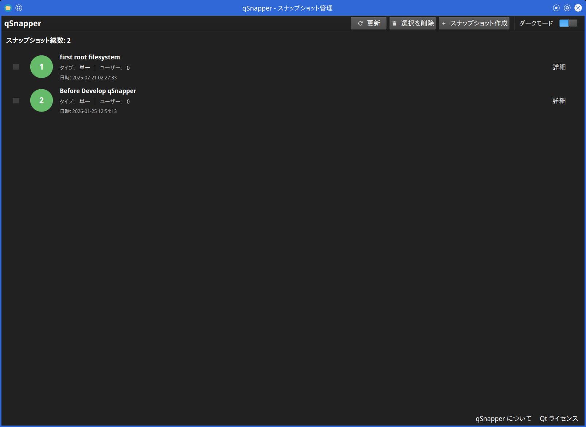
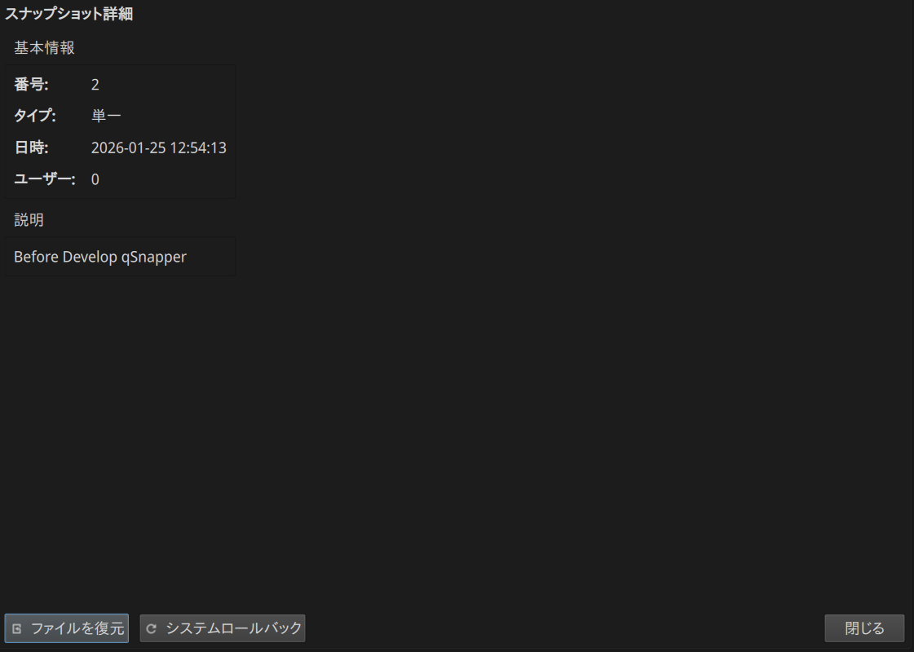
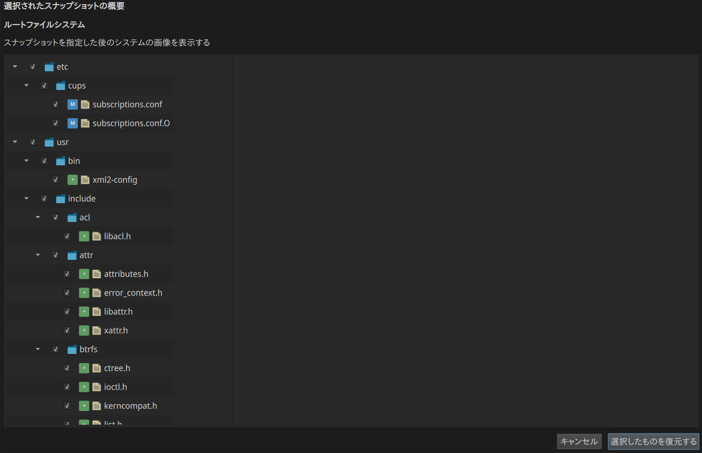
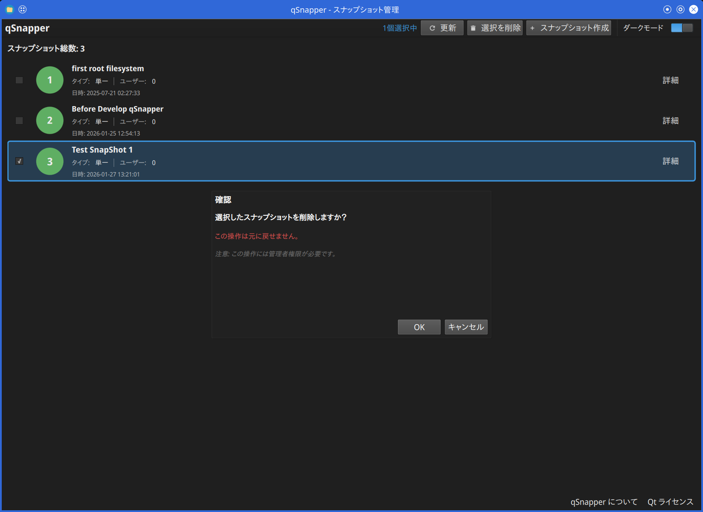

# qSnapper

Linux向けのBtrfs/Snapperファイルシステムスナップショットを管理するモダンなQt6/QML GUIアプリケーションです。  

  
  
  

## 概要

qSnapperは、Snapperスナップショット管理ツールのグラフィカルユーザーインターフェースです。  
Btrfsやその他のサポートされているファイルシステム上でファイルシステムスナップショットを作成、閲覧、管理するための直感的な方法を提供します。  

### 機能

- **スナップショット管理**:  
  ファイルシステムスナップショットの作成、表示、削除  
- **スナップショットタイプ**:  
  Single、Pre、Postスナップショットをサポート  
- **クリーンアップポリシー**:  
  NumberまたはTimelineアルゴリズムを使用した自動クリーンアップの設定  
- **ファイル比較**:  
  スナップショット間の変更を詳細なdiffプレビューで表示  
- **復元プレビュー**:  
  スナップショットから復元する前にファイルをプレビュー  
- **テーマサポート**:  
  ライト/ダークモード切り替え対応  
- **国際化対応**:  
  多言語サポート（英語、日本語）  
- **モダンなUI**:  
  Qt6 Quick/QMLで構築された応答性の高いユーザーエクスペリエンス  
- **安全な操作**:  
  D-BusとPolicyKitを使用した権限昇格  

## スクリーンショット

### メインウィンドウ - スナップショット一覧

メインウィンドウには、すべての利用可能なスナップショットがスナップショット番号、タイプ、タイムスタンプ、説明などの詳細情報とともに表示されます。  



### スナップショット作成ダイアログ

スナップショットタイプ（Single/Pre/Post）、説明、クリーンアップアルゴリズムなど、  
カスタマイズ可能なオプションで新しいスナップショットを作成できます。  


### スナップショット詳細ダイアログ

特定のスナップショットの詳細情報（ファイル変更、メタデータ、利用可能なアクションなど）を表示します。  



### 復元プレビューダイアログ

スナップショットから復元する前にファイル変更をプレビューします。  
これにより、何が変更されるかを理解できます。  



### スナップショット削除ダイアログ

削除されるスナップショットを表示する安全確認ダイアログでスナップショットの削除を確認します。  

  

## 要件

### 実行時依存関係

- Linuxオペレーティングシステム（必須）
- Qt6 (>= 6.2)
  - Qt6 Core
  - Qt6 GUI
  - Qt6 Quick
  - Qt6 Qml
  - Qt6 DBus
- Snapper (>= 0.8.0)
- PolicyKit (polkit)
- D-Bus

### ビルド依存関係

- CMake (>= 3.16)
- C++17対応コンパイラ（GCC、Clang）
- Qt6開発パッケージ
- PolicyKit-Qt6開発ファイル
- Snapper開発ヘッダー

## インストール

### ソースからビルド

#### 1. 依存関係のインストール

**openSUSE Leap 16 / SUSE Linux Enterprise 16**  

```bash
sudo zypper install cmake gcc-c++ \
                    qt6-base-devel qt6-declarative-devel qt6-linguist-devel \
                    polkit-devel libpolkit-qt6-1-devel \
                    libsnapper-devel
```

**RHEL 9 / 10**

```bash
sudo dnf install cmake gcc-c++ \
                 qt6-qtbase-devel qt6-qtdeclarative-devel qt6-linguist-devel \
                 polkit-devel polkit-qt6-1-devel \
                 snapper-devel
```

#### 2. ビルドとインストール

```bash
git clone https://github.com/presire/qSnapper.git
cd qSnapper
mkdir build && cd build

cmake -DCMAKE_INSTALL_PREFIX=/usr ..
make -j$(nproc)
sudo make install
```

**ビルドオプション:**  

- **SELinuxサポート** (オプション、デフォルト: 無効):  
  
  ```bash
  cmake -DCMAKE_INSTALL_PREFIX=/usr -DENABLE_SELINUX=ON ..
  ```

  SELinux Mandatory Access Control (MAC) ポリシーモジュールのインストールを有効化します。  

  **SELinuxの要件:**  
  - openSUSE / SUSE Linux Enterprise:

    ```bash
    sudo zypper install selinux-policy-devel policycoreutils
    ```

  - RHEL 9 / 10:

    ```bash
    sudo dnf install selinux-policy-devel policycoreutils-python-utils
    ```

  SELinux設定の詳細については、[selinux/README_JP.md](selinux/README_JP.md) を参照してください。

- **ログディレクトリ** (オプション、デフォルト: `/var/log/qsnapper`):

  ```bash
  cmake -DCMAKE_INSTALL_PREFIX=/usr -DQSNAPPER_LOG_DIR=/path/to/log/dir ..
  ```

  D-Busサービスがログファイルを出力するディレクトリを変更します。
  ログファイル名（`qsnapper-dbus.log`）は変更できません。
  未指定の場合、ログは `/var/log/qsnapper` に出力されます。

#### 3. インストール後の手順

インストールプロセスは自動的に以下をインストールします：  
- D-Busサービスファイルを `/usr/share/dbus-1/system-services/` に
- D-Bus設定ファイルを `/usr/share/dbus-1/system.d/` に
- PolicyKitポリシーを `/usr/share/polkit-1/actions/` に
- デスクトップエントリを `/usr/share/applications/` に
- アプリケーションアイコンを `/usr/share/icons/hicolor/128x128/apps/` に

D-BusとPolicyKitをリロード：  

```bash
sudo systemctl reload dbus
```

## 使用方法

### qSnapperの起動

qSnapperは以下の方法で起動できます：  
- アプリケーションメニュー（システムツールカテゴリ）
- コマンドライン: `qsnapper`

### スナップショットの作成

1. 「スナップショット作成」ボタンをクリック
2. スナップショットタイプを選択（Single、Pre、Post）
3. 説明を入力
4. クリーンアップアルゴリズムを選択（オプション）
5. 「作成」をクリック

### スナップショットの表示

メインウィンドウには、すべてのスナップショットのリストが以下の情報とともに表示されます：  
- スナップショット番号
- タイプ（Single、Pre、Post）
- 日付と時刻
- 作成したユーザー
- 説明

### スナップショットの比較

スナップショットを選択して以下を表示：  
- 追加、変更、削除されたファイル
- 詳細なファイルの差分

### スナップショットからの復元

1. スナップショットを選択
2. 「復元」または「変更をプレビュー」をクリック
3. 行われる変更を確認
4. 復元を確認

**警告**  
スナップショットの復元は現在のデータを上書きする可能性があります。  
確認する前に必ず変更を確認してください。  

## 設定

### Snapperの設定

qSnapperは既存のSnapper設定を使用します。  
ルートファイルシステムのSnapper設定を行うには：  

```bash
sudo snapper -c root create-config /
```

他のファイルシステムの場合：  
```bash
sudo snapper -c <設定名> create-config <マウントポイント>
```

### アプリケーション設定

アプリケーション設定は以下に保存されます：  
- `~/.config/Presire/qSnapper.conf`

設定内容：  
- テーマモード（ライト、ダーク）
- ウィンドウの位置とサイズ
- ユーザー設定

### テーマ設定

qSnapperは、組み込みのThemeManagerを通じてテーマ切り替えをサポートしています：  

1. **ライトモード**:  
   マテリアルデザインカラーに基づいた最適化された明るい配色  
2. **ダークモード**:  
   低照度環境に適した快適なダーク配色  

テーマ設定はアプリケーション設定に自動的に保存され、UIから切り替えることができます。  

## トラブルシューティング

### D-Bus接続エラー

D-Bus接続エラーが表示される場合：  

1. D-Busサービスファイルがインストールされているか確認：  
   
   ```bash
   ls /usr/share/dbus-1/system-services/com.presire.qsnapper.Operations.service
   ```

2. D-Bus設定を確認：  
   
   ```bash
   ls /usr/share/dbus-1/system.d/com.presire.qsnapper.Operations.conf
   ```

3. D-Busサービスのステータスを確認：  
   
   ```bash
   systemctl status dbus
   ```

### 権限拒否エラー

権限エラーで操作が失敗する場合：  

1. PolicyKitポリシーがインストールされているか確認：  
   
   ```bash
   ls /usr/share/polkit-1/actions/com.presire.qsnapper.policy
   ```

2. ユーザーが必要なグループに所属しているか確認（実装固有）  

### Snapperが設定されていない

Snapperが設定されていない場合：  

```bash
sudo snapper list-configs
```

設定が存在しない場合は、設定セクションに示されているように作成してください。  

## 開発

### 開発用ビルド

```bash
mkdir build-debug && cd build-debug
cmake -DCMAKE_BUILD_TYPE=Debug ..
make -j$(nproc)
```

### プロジェクト構造

```
qSnapper/
├── CMakeLists.txt             # ビルド設定
├── src/                       # C++ソースファイル
│   ├── main.cpp              # アプリケーションエントリポイント
│   ├── fssnapshot.cpp        # スナップショットデータモデル
│   ├── snapperservice.cpp    # Snapperサービスインターフェース
│   ├── snapshotlistmodel.cpp # スナップショットリストモデル
│   ├── filechangemodel.cpp   # ファイル変更ツリーモデル
│   ├── thememanager.cpp      # テーマ管理（ライト/ダークモード）
│   └── dbusservice/          # D-Busサービス実装
│       ├── main.cpp          # D-Busサービスエントリポイント
│       └── snapshotoperations.cpp  # D-Busメソッド実装
├── include/                  # ヘッダーファイル
├── qml/                      # QMLユーザーインターフェース
│   ├── Main.qml             # メインウィンドウ（テーマサポート付き）
│   ├── pages/               # ページコンポーネント
│   │   └── SnapshotListPage.qml
│   └── components/          # 再利用可能なコンポーネント
│       ├── SnapshotItem.qml
│       ├── SnapshotDetailDialog.qml
│       ├── RestorePreviewDialog.qml
│       ├── AboutqSnapperDialog.qml
│       └── AboutQtDialog.qml
├── icons/                   # アプリケーションアイコン
├── dbus/                    # D-Bus設定ファイル
├── polkit/                  # PolicyKitポリシーファイル
└── translations/            # 翻訳ファイル
    └── qsnapper_ja.ts       # 日本語翻訳
```

## コントリビューション

コントリビューションを歓迎します！  
イシューやプルリクエストを自由に提出してください。  

### ガイドライン

1. 既存のコードスタイルに従う
2. 変更を徹底的にテストする
3. 必要に応じてドキュメントを更新する
4. すべてのコミットに署名する

## ライセンス

このプロジェクトはGNU General Public License v3.0以降の下でライセンスされています。  
詳細については[LICENSE.md](LICENSE.md)ファイルを参照してください。  

## 謝辞

- [Snapper](http://snapper.io/) - スナップショット管理ツール
- [Qt Project](https://www.qt.io/) - クロスプラットフォームフレームワーク
- [PolicyKit](https://www.freedesktop.org/software/polkit/) - 認可フレームワーク

## リンク

- GitHubリポジトリ: https://github.com/presire/qSnapper
- イシュートラッカー: https://github.com/presire/qSnapper/issues
- Snapperドキュメント: http://snapper.io/documentation.html

## 作者

**Presire**  
- GitHub: [@presire](https://github.com/presire)  
