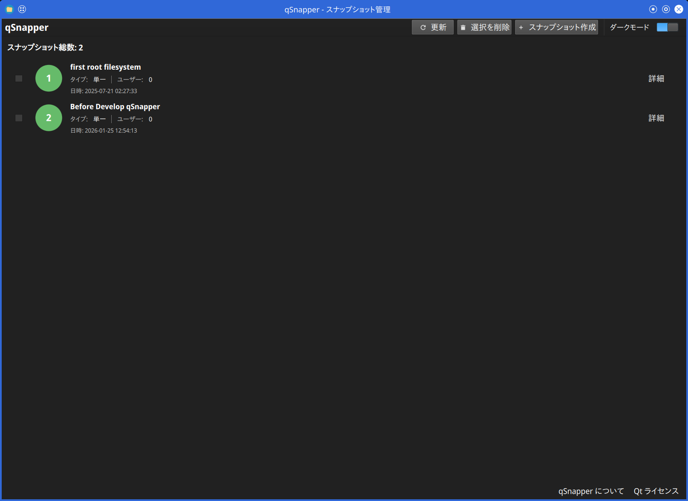
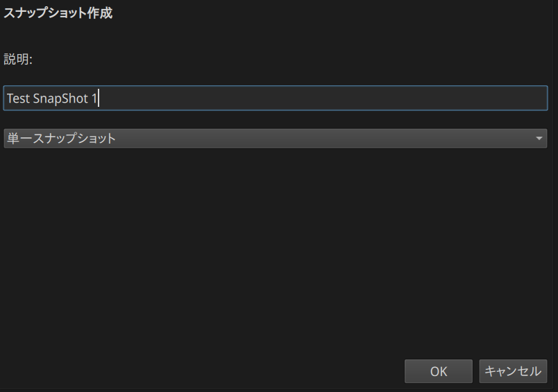
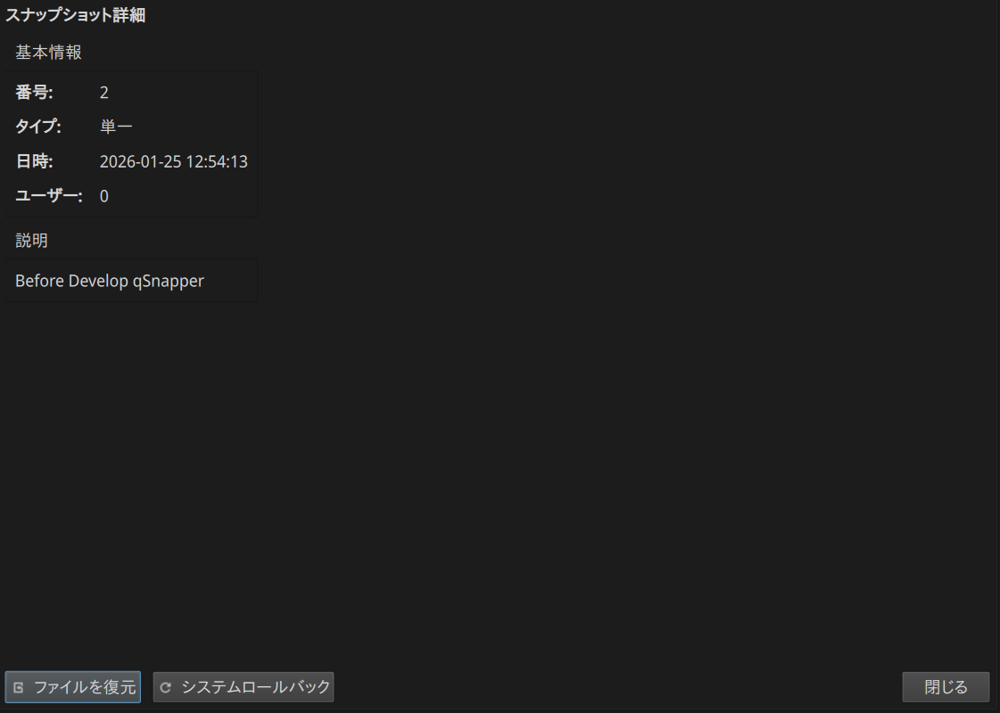
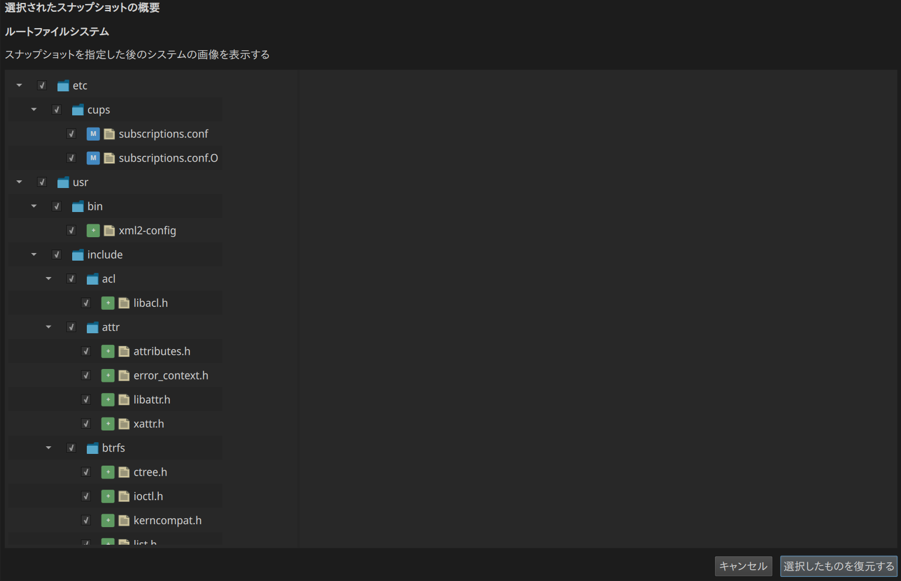
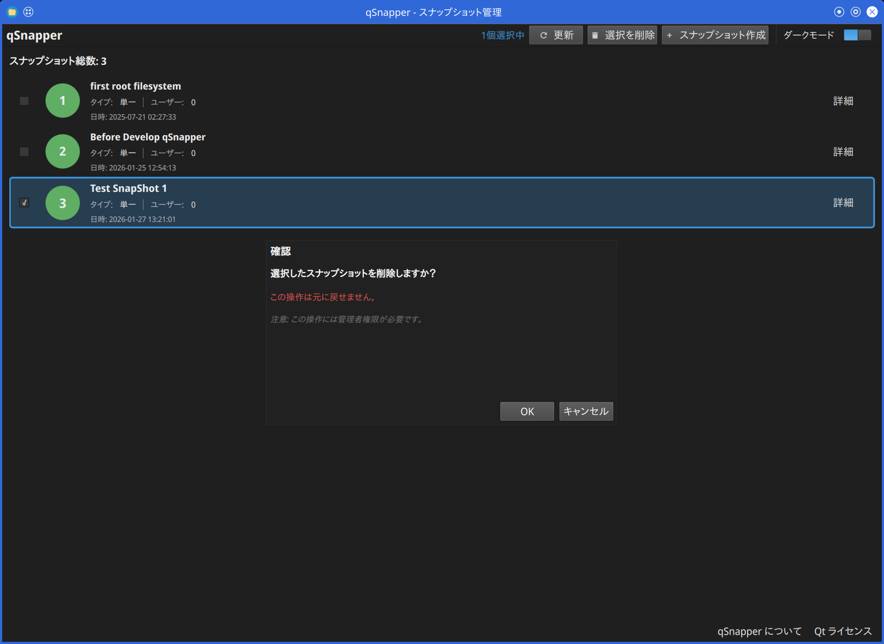

# qSnapper

Linux向けのBtrfs/Snapperファイルシステムスナップショットを管理するモダンなQt6/QML GUIアプリケーションです。  

  
  
  

<p align="center">
  
  
</p>

## 概要

qSnapperは、Snapperスナップショット管理ツールのグラフィカルユーザインターフェースです。  
Btrfsやその他のサポートされているファイルシステム上でファイルシステムスナップショットを作成、閲覧、管理するための直感的な方法を提供します。  

### 機能

- **スナップショット管理**:  
  ファイルシステムスナップショットの作成、表示、削除  
- **スナップショットタイプ**:  
  Single、Pre、Postスナップショットをサポート  
- **クリーンアップポリシー**:  
  NumberまたはTimelineアルゴリズムを使用した自動クリーンアップの設定  
- **ファイル比較**:
  スナップショット間の変更を詳細なdiffプレビューで表示
- **Pre/Postスナップショット比較**:
  Preスナップショットへの復元、Postスナップショットの再適用、および各スナップショットと現在のシステムの差分表示を切り替え可能。復元はPreとPostの間で変更されたファイルのみに影響
- **復元プレビュー**:
  スナップショットから復元する前にファイルをプレビュー
- **高速復元**:
  2つの復元モード — Direct Copy (高速、btrfs reflink対応)とYaST互換 — を搭載し、バッチサイズ設定とリアルタイム進捗ログを提供
- **テーマサポート**:  
  ライト/ダークモード切り替え対応  
- **国際化対応**:
  多言語サポート (英語、日本語、ドイツ語)
- **モダンなUI**:  
  Qt6 Quick/QMLで構築された応答性の高いユーザエクスペリエンス  
- **安全な操作**:  
  D-BusとPolicyKitを使用した権限昇格  

## スクリーンショット

### メインウィンドウ - スナップショット一覧

メインウィンドウには、すべての利用可能なスナップショットがスナップショット番号、タイプ、タイムスタンプ、説明などの詳細情報とともに表示されます。  

<p align="center"></p>

### スナップショット作成ダイアログ

スナップショットタイプ (Single/Pre/Post)、説明、クリーンアップアルゴリズムなど、  
カスタマイズ可能なオプションで新しいスナップショットを作成できます。  

<p align="center"></p>

### スナップショット詳細ダイアログ

特定のスナップショットの詳細情報 (ファイル変更、メタデータ、利用可能なアクションなど)を表示します。  

<p align="center"></p>

### 復元プレビューダイアログ

スナップショットから復元する前にファイル変更をプレビューします。  
これにより、何が変更されるかを理解できます。  

<p align="center"></p>

### 復元設定ダイアログ

ファイル復元前に、復元方式（ダイレクトコピー / YaST互換）とバッチサイズを設定できます。  

<p align="center"></p>

### スナップショット削除ダイアログ

削除されるスナップショットを表示する安全確認ダイアログでスナップショットの削除を確認します。  

<p align="center"></p>  

## 要件

### 実行時依存関係

- Linuxオペレーティングシステム (必須)
- Qt6 (>= 6.2)
  - Qt6 Core
  - Qt6 GUI
  - Qt6 Quick
  - Qt6 QuickControls2
  - Qt6 Qml
  - Qt6 DBus
- Snapper (>= 0.8.0)
- PolicyKit (polkit)
- D-Bus

### ビルド依存関係

- CMake (>= 3.16)
- C++17対応コンパイラ (GCC、Clang)
- Qt6開発パッケージ
- PolicyKit-Qt6開発ファイル
- Snapper開発ヘッダー
- scdoc (オプション、manページ生成用。未インストールの場合はmanページ生成をスキップ)

## インストール

### ソースからビルド

#### 1. 依存関係のインストール

**openSUSE Leap 16 / SUSE Linux Enterprise 16**  

```bash
sudo zypper install cmake gcc-c++ \
                    qt6-base-devel qt6-declarative-devel qt6-quickcontrols2-devel qt6-linguist-devel \
                    polkit-devel libpolkit-qt6-1-devel \
                    libsnapper-devel libbtrfsutil-devel scdoc
```

**RHEL 9 / 10**

```bash
sudo dnf install cmake gcc-c++ \
                 qt6-qtbase-devel qt6-qtdeclarative-devel qt6-qtquickcontrols2-devel qt6-linguist-devel \
                 polkit-devel polkit-qt6-1-devel \
                 snapper-devel btrfs-progs-devel scdoc
```

**Debian 13 (trixie)**  

```bash
sudo apt install cmake g++ make pkg-config \
                 qt6-base-dev qt6-declarative-dev qt6-tools-dev \
                 libpolkit-qt6-1-dev libpolkit-gobject-1-dev \
                 libsnapper-dev libboost-dev libbtrfs-dev libbtrfsutil-dev scdoc
```

**Note:**  
D-Busシステムサービスはpolkit-gobject-1 APIを直接使用しており、ビルド時には `pkg-config` (`polkit-gobject-1.pc`) で検出されます。  
このモジュールはopenSUSEおよびRHEL/Fedoraでは `polkit-devel` に、Debianでは `libpolkit-gobject-1-dev` に同梱されているため (上記コマンドに既に含まれています)、追加のパッケージは不要です。  

#### 2. ビルドとインストール

```bash
git clone https://github.com/presire/qSnapper.git
cd qSnapper
mkdir build && cd build

cmake -DCMAKE_INSTALL_PREFIX=/usr ..
make -j$(nproc)
sudo make install
```

**ビルドオプション:**  

- **SELinuxサポート** (オプション、デフォルト: 無効):  
  
  ```bash
  cmake -DCMAKE_INSTALL_PREFIX=/usr -DENABLE_SELINUX=ON ..
  ```

  SELinux Mandatory Access Control (MAC) ポリシーモジュールのインストールを有効化します。  

  **SELinuxの要件:**  
  - openSUSE / SUSE Linux Enterprise:

    ```bash
    sudo zypper install selinux-policy-devel policycoreutils
    ```

  - RHEL 9 / 10:

    ```bash
    sudo dnf install selinux-policy-devel policycoreutils-python-utils
    ```

  SELinux設定の詳細については、[selinux/README_JP.md](selinux/README_JP.md) を参照してください。

- **ログディレクトリ** (オプション、デフォルト: `/var/log/qsnapper`):

  ```bash
  cmake -DCMAKE_INSTALL_PREFIX=/usr -DQSNAPPER_LOG_DIR=/path/to/log/dir ..
  ```

  D-Busサービスがログファイルを出力するディレクトリを変更します。
  ログファイル名 (`qsnapper-dbus.log`)は変更できません。
  未指定の場合、ログは `/var/log/qsnapper` に出力されます。

#### 3. インストール後の手順

インストールプロセスは自動的に以下をインストールします：  
- D-Busサービスファイルを `/usr/share/dbus-1/system-services/` に
- D-Bus設定ファイルを `/usr/share/dbus-1/system.d/` に
- PolicyKitポリシーを `/usr/share/polkit-1/actions/` に
- デスクトップエントリを `/usr/share/applications/` に
- アプリケーションアイコンを `/usr/share/icons/hicolor/128x128/apps/` に
- manページを `/usr/share/man/man1/` に (`man qsnapper` で参照可能。ビルド時にscdocが利用可能な場合のみ)

D-BusとPolicyKitをリロード：  

```bash
sudo systemctl reload dbus
```

## 使用方法

### qSnapperの起動

qSnapperは以下の方法で起動できます：  
- アプリケーションメニュー (システムツールカテゴリ)
- コマンドライン: `qsnapper`

### スナップショットの作成

1. 「スナップショット作成」ボタンをクリック
2. スナップショットタイプを選択 (Single、Pre、Post)
3. 説明を入力
4. クリーンアップアルゴリズムを選択 (オプション)
5. 「作成」をクリック

### スナップショットの表示

メインウィンドウには、すべてのスナップショットのリストが以下の情報とともに表示されます：  
- スナップショット番号
- タイプ (Single、Pre、Post)
- 日付と時刻
- 作成したユーザ
- 説明

### スナップショットの比較

スナップショットを選択して以下を表示：  
- 追加、変更、削除されたファイル
- 詳細なファイルの差分

### スナップショットからの復元

1. スナップショットを選択  
2. 「変更点の表示」をクリックしてスナップショット概要画面を開く  
3. ツリービューとdiffパネルでファイル変更を確認  
4. 復元したいファイル/ディレクトリにチェックを入れる  
5. 「選択項目を復元」をクリックしてチェックした項目を復元  

Pre/Postスナップショットペアの場合、スナップショット概要画面には4つの表示モードがあります：  
- **Revert to Pre #N**: Pre #NとPost #Mの間の変更を取り消す (復元可能、ダイアログを開いたときのデフォルト)  
- **Re-apply to Post #M**: Pre #NとPost #Mの間の変更をやり直す (復元可能)  
- **Show differences between snapshot #N (Pre) and the current system**: 現在のシステムとの差分を表示 (表示のみ)  
- **Show differences between snapshot #M (Post) and the current system**: 現在のシステムとの差分を表示 (表示のみ)  

チェックボックスと復元ボタンは、復元可能な2つの表示モードでのみ利用できます。2つの「現在のシステムとの差分」表示モードは読み取り専用で、ヒント「View only. Choose a Pre / Post difference above to restore.」を表示します。  

復元可能な2つの表示モードでは、現在のシステムとまだ差異があるエントリのみが一覧表示されます。現在の状態が既に復元先と一致しているエントリ (既に復元済みのファイルや、Postスナップショット後にパッケージマネージャが再度削除したファイルなど) は、復元しても何も変わらないため非表示になります。全てのエントリが除外された場合、ツリーには「このスナップショットとの差分はありません」と表示されます。この絞り込みが復元対象を広げることはありません。一覧は常にPre/Post間の差分の部分集合であり、その範囲外で変更されたファイルが追加されることはありません。  

復元に成功すると、表示は自動的に「復元先スナップショットと現在のシステムの差分」へ切り替わり、復元結果をその場で確認できます。Pre/Postの範囲外で変更されたファイル (Postスナップショット作成後に手動で作成したファイルなど) はそこに残って表示されるため、意図せず巻き戻っていないことも確認できます。  

Pre/Postペアの復元ボタンは「Restore Selected to #<number>」と表示されます。復元はPreスナップショットとPostスナップショットの間で実際に差分のあるファイルのみを対象とし、その範囲外で変更されたファイル (例えばPostスナップショット作成後に手動で作成したファイル) はそのまま残されます。これは上流の `snapper undochange <pre>..<post>` と同じ動作です。  

#### 復元モード

qSnapperは2つの復元方式を提供しており、復元確認ダイアログから選択できます：  

- **Direct Copy (高速)** (デフォルト):  
  マウントされたスナップショットから `cp -a --reflink=auto` でファイルを直接コピーします。  
  Btrfsではreflinkによりファイルサイズに関わらずほぼ瞬時のcopy-on-writeが可能です。  

- **YaST互換**:  
  YaSTの「ファイルシステムのスナップショット」モジュールと同じ復元方式 (reflink無しの `cp -a`)を使用します。  
  Direct Copy方式で互換性の問題が発生した場合にこのモードを使用してください。  

#### 復元オプション

- **バッチサイズ** (1〜1000、デフォルト: 100):  
  復元計画がfreezeされる前に、1つのstaging chunkとして送信するファイル数です。値を大きくするとスループットが向上する場合があります。値を小さくするとより細かな進捗表示が得られます。選択したファイル数やchunk数に関わらず、複数ファイルの復元にはcommit時に一度だけPolicyKit認証が必要であり、frozen計画の実行中に再認証を求められることはありません。  

復元中は、リアルタイムの進捗ログに各ファイルの復元状況が自動スクロール付きで表示されます。  

**警告**:  
スナップショットの復元は現在のデータを上書きする可能性があります。  
確認する前に必ず変更を確認してください。  

**注意**:  
PreスナップショットとPostスナップショットの間の変更で新しいディレクトリ全体が作成された場合 (例えばパッケージインストールが `/etc/foo/` を追加した場合)、Preへ戻すとそのディレクトリは再帰的に削除され、その後で中に追加したファイル (例えば `/etc/foo/mine.conf`) も削除されます。これは `snapper undochange` と同じ動作であり、意図的なものです。  

## 設定

### Snapperの設定

qSnapperは既存のSnapper設定を使用します。  
ルートファイルシステムのSnapper設定を行うには：  

```bash
sudo snapper -c root create-config /
```

他のファイルシステムの場合：  
```bash
sudo snapper -c <設定名> create-config <マウントポイント>
```

### アプリケーション設定

アプリケーション設定は以下に保存されます：  
- `~/.config/Presire/qSnapper.conf`

設定内容：  
- テーマモード (ライト、ダーク)
- ウィンドウの位置とサイズ
- 復元方式 (Direct Copy / YaST互換)
- 復元バッチサイズ (1〜1000)
- ユーザ設定

### テーマ設定

qSnapperは、組み込みのThemeManagerを通じてテーマ切り替えをサポートしています：  

1. **ライトモード**:  
   マテリアルデザインカラーに基づいた最適化された明るい配色  
2. **ダークモード**:  
   低照度環境に適した快適なダーク配色  

テーマ設定はアプリケーション設定に自動的に保存され、UIから切り替えることができます。  

## トラブルシューティング

### D-Bus接続エラー

D-Bus接続エラーが表示される場合：  

1. D-Busサービスファイルがインストールされているか確認：  
   
   ```bash
   ls /usr/share/dbus-1/system-services/com.presire.qsnapper.Operations.service
   ```

2. D-Bus設定を確認：  
   
   ```bash
   ls /usr/share/dbus-1/system.d/com.presire.qsnapper.Operations.conf
   ```

3. D-Busサービスのステータスを確認：  
   
   ```bash
   systemctl status dbus
   ```

### 権限拒否エラー

権限エラーで操作が失敗する場合：  

1. PolicyKitポリシーがインストールされているか確認：  
   
   ```bash
   ls /usr/share/polkit-1/actions/com.presire.qsnapper.policy
   ```

2. ユーザが必要なグループに所属しているか確認 (実装固有)  

### Snapperが設定されていない

Snapperが設定されていない場合：  

```bash
sudo snapper list-configs
```

設定が存在しない場合は、設定セクションに示されているように作成してください。  

## 開発

### 開発用ビルド

```bash
mkdir build-debug && cd build-debug
cmake -DCMAKE_BUILD_TYPE=Debug ..
make -j$(nproc)
```

### プロジェクト構造

```
qSnapper/
├── CMakeLists.txt                                  # トップレベルのビルド設定 (GUI、D-Busサービス、テスト、パッケージング)
├── qsnapper.desktop.in                             # デスクトップエントリのテンプレート
├── LICENSE.md                                      # プロジェクトのライセンス
├── README.md / README_JP.md                        # ドキュメント (英語 / 日本語)
├── .github/workflows/                              # CIワークフロー
│   └── release.yml                                 # CI: テスト、RPM/DEBビルド、バージョンタグでのリリース
├── src/                                            # C++ソースファイル
│   ├── main.cpp                                    # GUIアプリケーションのエントリポイント
│   ├── snapperservice.cpp                          # D-Busサービスを呼び出すクライアント側のインターフェース
│   ├── fssnapshot.cpp                              # スナップショットのデータモデル (1件分)
│   ├── fssnapshotstore.cpp                         # Preスナップショット番号のユーザ単位の永続化
│   ├── snapshotlistmodel.cpp                       # スナップショットのリストモデル
│   ├── snapshotgroupmodel.cpp                      # Pre/Postスナップショットのグループ化モデル
│   ├── filechangemodel.cpp                         # ファイル変更のツリーモデル (比較、差分、復元計画)
│   ├── thememanager.cpp                            # テーマ管理 (ライト/ダークモード)
│   ├── windowstatemanager.cpp                      # ウィンドウサイズと最大化状態の永続化
│   ├── singleinstanceguard.cpp                     # 多重起動の防止 (ロックファイルとローカルソケット)
│   └── dbusservice/                                # 特権D-Busサービス (rootで動作)
│       ├── main.cpp                                # サービスのエントリポイント (オブジェクト登録、ログ、アイドル終了)
│       ├── snapshotoperations.{cpp,h}              # D-Busメソッドの実装 (スナップショット操作、復元計画、polkit認可)
│       ├── inputvalidator.{cpp,h}                  # D-Bus経由の信頼できない入力の検証
│       ├── filesystemhelpers.{cpp,h}               # ルート配下での安全なファイル操作 (symlinkを辿らない)
│       ├── restoremanifest.{cpp,h}                 # 復元計画の管理 (呼び出し元への束縛、上限、保持期間)
│       ├── restoreplanexecutor.{cpp,h}             # 凍結済み復元計画の分割実行
│       ├── restorevalidation.{cpp,h}               # 復元先の組み立てと復元エントリの検証
│       └── comparisoncache.h                       # libsnapperの比較結果の1件キャッシュ
├── include/                                        # GUIアプリケーションのヘッダーファイル
│   ├── csvrecord.h                                 # CSVのクォートと解析 (サービスとクライアントで共用)
│   ├── externalurlopener.h                         # http/httpsリンクをデスクトップポータル経由で開く
│   ├── filechangemodel.h                           # ファイル変更モデルと復元計画の転送
│   ├── fssnapshot.h                                # スナップショットのデータモデル
│   ├── fssnapshotstore.h                           # Preスナップショット番号のストア
│   ├── singleinstanceguard.h                       # 多重起動の防止
│   ├── snapperservice.h                            # クライアント側のD-Busインターフェース
│   ├── snapshotgroupmodel.h                        # Pre/Postのグループ化モデル
│   ├── snapshotlistmodel.h                         # スナップショットのリストモデル
│   ├── thememanager.h                              # テーママネージャ
│   └── windowstatemanager.h                        # ウィンドウ状態の管理
├── qml/                                            # QMLユーザインターフェース
│   ├── Main.qml                                    # メインウィンドウ (テーマ対応)
│   ├── pages/                                      # ページコンポーネント
│   │   └── SnapshotListPage.qml                    # スナップショット一覧ページ
│   └── components/                                 # 再利用可能なコンポーネント
│       ├── AboutQtDialog.qml                       # Qtについてのダイアログ
│       ├── AboutqSnapperDialog.qml                 # qSnapperについてのダイアログ
│       ├── BorderedDialog.qml                      # テーマに追従する枠付きダイアログの基底型
│       ├── CompareSnapshotsDialog.qml              # 任意の2スナップショット間のファイル差分
│       ├── RestorePreviewDialog.qml                # 復元のプレビュー、オプション、進捗
│       ├── SnapshotDetailDialog.qml                # スナップショットの詳細、ファイル復元、ロールバック
│       ├── SnapshotEditDialog.qml                  # スナップショットのメタデータ編集
│       ├── SnapshotItem.qml                        # スナップショット一覧の項目デリゲート
│       ├── SnapshotTableHeader.qml                 # スナップショットテーブルのヘッダ行
│       └── SnapshotTableRow.qml                    # スナップショットテーブルの行デリゲート
├── dbus/                                           # D-Bus設定ファイル
│   ├── com.presire.qsnapper.Operations.conf        # バスポリシー (許可するメソッド)
│   ├── com.presire.qsnapper.Operations.service.in  # サービス起動定義のテンプレート
│   └── com.presire.qsnapper.Operations.xml         # インターフェース定義 (introspection XML)
├── polkit/                                         # PolicyKitポリシー
│   └── com.presire.qsnapper.policy                 # 認可アクションの定義
├── systemd/tmpfiles.d/                             # systemd tmpfiles設定
│   └── qsnapper.conf                               # ログディレクトリ /var/log/qsnapper の作成 (0700)
├── selinux/                                        # SELinuxポリシーモジュール
│   ├── qsnapper.te                                 # Type Enforcementルール
│   ├── qsnapper.if                                 # インターフェース定義
│   ├── qsnapper.fc.in                              # ファイルコンテキストのテンプレート (CMakeが生成)
│   ├── qsnapper.fc                                 # 単体のMakefileビルド用ファイルコンテキスト
│   ├── CMakeLists.txt                              # ポリシーのビルド (CMake)
│   ├── Makefile                                    # ポリシーのビルド (単体)
│   ├── ADMIN.md / ADMIN_JP.md                      # 管理者ガイド (英語 / 日本語)
│   ├── README.md / README_JP.md                    # ポリシーの概要 (英語 / 日本語)
│   └── qsnapper-architecture.*                     # アーキテクチャ図 (.drawio / .png)
├── cmake/                                          # CMakeの補助ファイルとパッケージング用スクリプト
│   ├── packaging.cmake                             # CPackパッケージング設定 (RPM/DEB)
│   ├── rpm-post-install.sh                         # RPMのインストール後処理 (SELinuxモジュールのロード、ログディレクトリ作成)
│   └── rpm-pre-uninstall.sh                        # RPMのアンインストール前処理 (SELinuxモジュールの削除)
├── man/                                            # manページのソース (scdoc)
│   └── qsnapper.1.scd                              # qsnapper(1) manページ
├── icons/                                          # アプリケーションとUIのアイコン
├── translations/                                   # 翻訳ファイル
│   ├── qsnapper_ja.ts                              # 日本語翻訳
│   └── qsnapper_de.ts                              # ドイツ語翻訳
├── tests/                                          # テスト (QSNAPPER_BUILD_TESTS=ONで有効)
│   ├── unit/                                       # Qt Testの単体テスト (コンポーネントごとにtst_*.cpp)
│   ├── integration/                                # D-Bus契約の検査と隔離D-Bus環境のテスト
│   ├── security_poc/                               # 脆弱性のPoCスクリプト (専用VMでのみ実行)
│   └── TESTREPORT_v1.3.3.md                        # テストレポートのテンプレート
├── Licenses/                                       # サードパーティのライセンス
│   ├── Qt.md, D-Bus.md, PolicyKit.md               # ライセンス本文 (Qt、D-Bus、PolicyKit)
│   └── Polkit-Qt.md, Snapper.md, Btrfs-progs.md    # ライセンス本文 (Polkit-Qt、Snapper、Btrfs-progs)
└── ScreenShot/                                     # READMEで使用するスクリーンショット
```

## コントリビューション

コントリビューションを歓迎します！  
Issueやプルリクエストを自由に提出してください。  

### ガイドライン

1. 既存のコードスタイルに従う  
2. 変更を徹底的にテストする  
3. 必要に応じてドキュメントを更新する  
4. すべてのコミットに署名する  

## ライセンス

このプロジェクトはGNU General Public License v2.0以降の下でライセンスされています。  
詳細については[LICENSE.md](LICENSE.md)ファイルを参照してください。  

## 謝辞

- [Snapper](http://snapper.io/) - スナップショット管理ツール
- [Qt Project](https://www.qt.io/) - クロスプラットフォームフレームワーク
- [PolicyKit](https://www.freedesktop.org/software/polkit/) - 認可フレームワーク

## リンク

- GitHubリポジトリ: https://github.com/presire/qSnapper
- イシュートラッカー: https://github.com/presire/qSnapper/issues
- Snapperドキュメント: http://snapper.io/documentation.html

## 作者

**Presire**  
- GitHub: [@presire](https://github.com/presire)  
