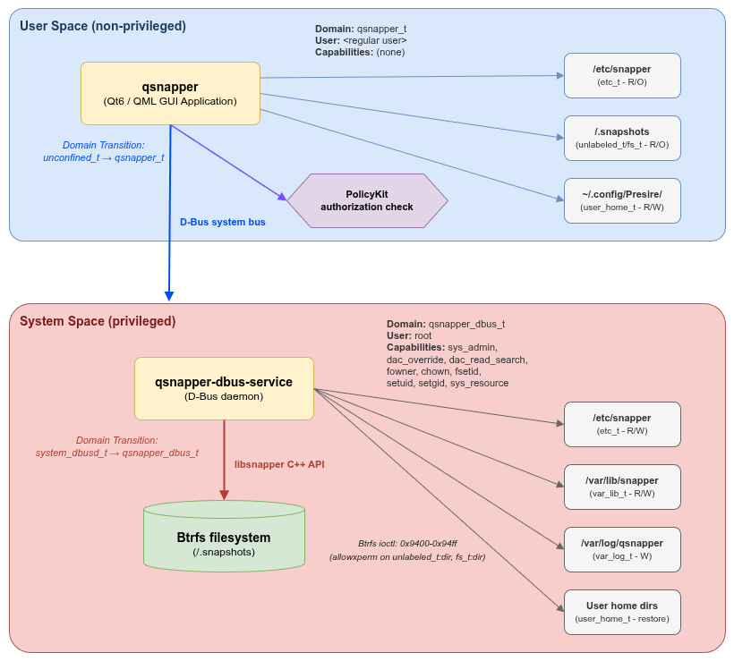

# qSnapper SELinux Policy Module - Administrator Guide

This document provides detailed information for system administrators who operate and manage the qSnapper SELinux policy module.

## Table of Contents

- [Architecture Overview](#architecture-overview)
- [Security Model](#security-model)
- [Policy Details](#policy-details)
- [Policy Customization](#policy-customization)
- [Auditing and Logging](#auditing-and-logging)
- [Performance Impact](#performance-impact)
- [Known Limitations and Considerations](#known-limitations-and-considerations)
- [Advanced Troubleshooting](#advanced-troubleshooting)

---

## Architecture Overview

### Two-Process Model

qSnapper adopts a two-process architecture based on the principle of privilege separation:



### Benefits of Domain Separation

1. **Principle of Least Privilege**:  
   Each process holds only the minimum required permissions  
2. **Reduced Attack Surface**:  
   GUI layer vulnerabilities do not directly affect privileged operations  
3. **Audit Granularity**:  
   Actions in each domain can be tracked independently  
4. **Policy Flexibility**:  
   Different security policies can be applied per domain  

---

## Security Model

### Mandatory Access Control (MAC) Layers

qSnapper security consists of the following three layers:

```
Layer 3: SELinux MAC (this policy)
         ↓
Layer 2: PolicyKit authorization
         ↓
Layer 1: D-Bus security policy
         ↓
         Filesystem operations
```

#### Layer 1: D-Bus Security Policy

File: `/usr/share/dbus-1/system.d/com.presire.qsnapper.Operations.conf`

- Connection permission to D-Bus system bus
- Method call permission control

#### Layer 2: PolicyKit Authorization

File: `/usr/share/polkit-1/actions/com.presire.qsnapper.policy`

Authentication requirements per action:
- `com.presire.qsnapper.list-snapshots`: No authentication required (allow_active)
- `com.presire.qsnapper.create-snapshot`: Authentication required
- `com.presire.qsnapper.delete-snapshot`: Authentication required
- `com.presire.qsnapper.rollback-snapshot`: Authentication required
- `com.presire.qsnapper.get-file-changes`: No authentication required
- `com.presire.qsnapper.restore-files`: Authentication required

#### Layer 3: SELinux MAC (This Policy)

- Per-process domain isolation
- Strict file and directory access control
- ioctl operation restrictions (only Btrfs ioctl range permitted)

### Authorization Flow

```
User action (GUI)
  → D-Bus method call
    → D-Bus policy check (Layer 1)
      → PolicyKit authorization (Layer 2)
        → SELinux domain transition check (Layer 3)
          → SELinux file access check (Layer 3)
            → Operation execution
```

**Operations are executed only when all layers are passed.**

---

## Policy Details

### Type Declarations

Types declared in the policy module (`qsnapper.te`):

| Type Name | Attributes | Purpose |
|---|---|---|
| `qsnapper_t` | `domain` | GUI application process domain |
| `qsnapper_exec_t` | `exec_type`, `file_type` | GUI application executable |
| `qsnapper_dbus_t` | `domain` | D-Bus service process domain |
| `qsnapper_dbus_exec_t` | `exec_type`, `file_type` | D-Bus service executable |
| `qsnapper_tmp_t` | `file_type` | Temporary files (auto-transition in `/tmp`) |
| `qsnapper_tmpfs_t` | `file_type` | tmpfs shared memory files |

### File Contexts

The file context definition (`qsnapper.fc.in`) assigns custom labels only to the two executables:

```
/usr/bin/qsnapper                       -- system_u:object_r:qsnapper_exec_t:s0
/usr/libexec/qsnapper-dbus-service      -- system_u:object_r:qsnapper_dbus_exec_t:s0
```

**Important:**  
System directories (`/etc/snapper`, `/.snapshots`, `/var/lib/snapper`, etc.) are not assigned custom labels. They use existing system labels (`etc_t`, `unlabeled_t`, `fs_t`, `var_lib_t`, etc.) as-is.  
This is a design decision to avoid conflicts with openSUSE's existing file context rules.  

### qsnapper_t Domain (GUI Application)

#### Permitted Operations

1. **Process Management**
   - Signal delivery to self (`fork`, `signal`, `signull`, `sigkill`, `sigstop`, `sigchld`)
   - Process group operations (`setpgid`, `getpgid`)
   - Scheduler parameter get/set (`getsched`, `setsched`)
   - FIFO, UNIX stream sockets, UNIX datagram sockets
   - Shared memory (SHM) operations
   - Semaphore operations

2. **GUI Requirements**
   - Qt6 Quick/QML runtime environment (Qt plugins, icons, themes via `usr_t`)
   - Font file access (`fonts_t`, `fonts_cache_t`)
   - Localization file reading (`locale_t`)
   - GPU rendering acceleration (including ioctl on `dri_device_t`)
   - tmpfs shared memory (`tmpfs_t` for X11/Wayland integration)
   - Device access (`null_device_t`, `zero_device_t`, `random_device_t`, `urandom_device_t`)

3. **D-Bus Communication**
   - System bus connection (client: `send_msg` to `system_dbusd_t`)
   - Message exchange with `qsnapper_dbus_t` domain

4. **File Access**
   - Configuration file reading under `/etc` (`etc_t` - including `/etc/snapper`, read-only)
   - Snapper metadata reading under `/var/lib` (`var_lib_t` - read-only)
   - Snapshot directory browsing (`unlabeled_t`, `fs_t` - `/.snapshots`, read-only)
   - User home directory configuration management (`user_home_t`, `user_home_dir_t` - `~/.config/Presire/`, read-write)
   - Temporary file creation (`tmp_t`, `qsnapper_tmp_t`)
   - `/proc`, `/sys` filesystem reading (`proc_t`, `sysfs_t`)
   - Kernel sysctl value reading (`sysctl_t`, `sysctl_kernel_t`)
   - Shared library loading (`lib_t`, `ld_so_t`, `ld_so_cache_t`, `textrel_shlib_t`)

5. **Other**
   - Syslog message delivery (`devlog_t`, `kernel_t`)
   - File descriptor inheritance (from `init_t`, `unconfined_t`)
   - Terminal access (`user_devpts_t`, `user_tty_device_t`)

#### Denied Operations

- Writing to snapshot directories
- Writing to `/etc/snapper` configuration files
- Btrfs ioctl operations
- Operations requiring root privileges (Linux capabilities)

### qsnapper_dbus_t Domain (D-Bus Service)

#### Permitted Operations

1. **Linux Capabilities**
   - `CAP_SYS_ADMIN`: Btrfs snapshot operations
   - `CAP_DAC_OVERRIDE`: Bypass ownership checks
   - `CAP_DAC_READ_SEARCH`: Bypass read permission checks
   - `CAP_FOWNER`: File ownership changes
   - `CAP_CHOWN`: File owner changes
   - `CAP_FSETID`: setuid/setgid bit setting
   - `CAP_SETUID`: UID changes
   - `CAP_SETGID`: GID changes
   - `CAP_SYS_RESOURCE`: Resource limit override (`setrlimit`)

2. **D-Bus Communication**
   - System bus connection (service: `send_msg` + `acquire_svc` for service name registration)
   - Message exchange with `qsnapper_t` domain

3. **File Access**
   - Configuration file read/write under `/etc` (`etc_t` - including `/etc/snapper`)
   - Snapper metadata read/write under `/var/lib` (`var_lib_t` - including directory creation/deletion)
   - Full snapshot directory management (`unlabeled_t`, `fs_t` - `/.snapshots`, including creation/deletion/mount)
   - File restoration: **user home directories only** (`user_home_t`, `user_home_dir_t`)
   - Log file management (`var_log_t` - create, write, append)
   - Runtime data (`var_run_t`)
   - Temporary file creation (`tmp_t`, `qsnapper_tmp_t`)
   - Shared library loading (`lib_t`, `ld_so_t`, `ld_so_cache_t`, `textrel_shlib_t`)
   - `/proc`, `/sys` filesystem reading (`proc_t`, `sysfs_t`)
   - Kernel sysctl value reading (`sysctl_t`, `sysctl_kernel_t`)
   - Localization file reading (`locale_t`)
   - Network configuration file reading (`net_conf_t` - hostname resolution)

4. **Btrfs ioctl Operations**
   - Btrfs ioctl on `unlabeled_t:dir` and `fs_t:dir` (0x9400-0x94ff range)

   ```selinux
   allowxperm qsnapper_dbus_t unlabeled_t:dir ioctl { 0x9400-0x94ff };
   allowxperm qsnapper_dbus_t fs_t:dir ioctl { 0x9400-0x94ff };
   ```

   This range includes:
   - `BTRFS_IOC_SNAP_CREATE_V2`: Snapshot creation
   - `BTRFS_IOC_SNAP_DESTROY`: Snapshot deletion
   - `BTRFS_IOC_DEFAULT_SUBVOL`: Default subvolume setting
   - Other Btrfs-related ioctls

5. **External Command Execution**
   - Executables in `bin_t` (`execute_no_trans` for same-domain execution)
   - Shell (`shell_exec_t`)

6. **Block Device Access**
   - Fixed disk devices (`fixed_disk_device_t` - for Btrfs operations)

7. **Other**
   - Syslog message delivery (`devlog_t`, `kernel_t`)
   - File descriptor inheritance (from `system_dbusd_t`)
   - Netlink route socket (`netlink_route_socket`)
   - Filesystem operations on `fs_t` (`getattr`, `mount`, `unmount`)

#### File Restoration Restrictions

File restoration operations are restricted to **user home directories only**.  
This restriction is a security constraint hardcoded in the `.te` policy.  

```selinux
# File restoration - LIMITED TO USER HOME DIRECTORIES ONLY
allow qsnapper_dbus_t user_home_dir_t:dir { ... };
allow qsnapper_dbus_t user_home_t:dir { ... };
allow qsnapper_dbus_t user_home_t:file { ... };
allow qsnapper_dbus_t user_home_t:lnk_file { ... };
```

### Domain Transitions

The policy defines the following two domain transitions:

1. **`unconfined_t` → `qsnapper_t`** (GUI application launch)

   ```selinux
   allow unconfined_t qsnapper_exec_t:file { getattr open read execute map };
   allow unconfined_t qsnapper_t:process transition;
   type_transition unconfined_t qsnapper_exec_t:process qsnapper_t;
   ```

2. **`system_dbusd_t` → `qsnapper_dbus_t`** (D-Bus service launch)

   ```selinux
   allow system_dbusd_t qsnapper_dbus_exec_t:file { getattr open read execute map };
   allow system_dbusd_t qsnapper_dbus_t:process transition;
   type_transition system_dbusd_t qsnapper_dbus_exec_t:process qsnapper_dbus_t;
   ```

### File Type Transitions

Files created in `/tmp` automatically transition to `qsnapper_tmp_t`:

```selinux
type_transition qsnapper_t tmp_t:file qsnapper_tmp_t;
type_transition qsnapper_t tmp_t:dir qsnapper_tmp_t;
type_transition qsnapper_dbus_t tmp_t:file qsnapper_tmp_t;
type_transition qsnapper_dbus_t tmp_t:dir qsnapper_tmp_t;
```

### Interface Definitions (.if)

`qsnapper.if` provides interfaces for other SELinux policy modules to integrate with qSnapper.  
These interfaces are for external module use and are not used by the qSnapper `.te` policy itself.  

| Interface | Purpose |
|---|---|
| `qsnapper_domtrans` | Allow domain transition from specified domain to `qsnapper_t` |
| `qsnapper_run` | Allow domain transition + assign `qsnapper_roles` attribute to role |
| `qsnapper_dbus_chat` | Allow D-Bus message exchange between specified domain and `qsnapper_t` |
| `qsnapper_read_config` | Allow reading `qsnapper_conf_t` type configuration files |
| `qsnapper_manage_config` | Allow managing `qsnapper_conf_t` type configuration files |
| `qsnapper_read_snapshots` | Allow reading `qsnapper_snapshot_t` type snapshot files |
| `qsnapper_manage_snapshots` | Allow managing `qsnapper_snapshot_t` type snapshot files |
| `qsnapper_dbus_domtrans` | Allow domain transition from specified domain to `qsnapper_dbus_t` |
| `qsnapper_dbus_service_chat` | Allow D-Bus message exchange between specified domain and `qsnapper_dbus_t` |
| `qsnapper_read_log` | Allow reading `qsnapper_log_t` type log files |
| `qsnapper_append_log` | Allow appending to `qsnapper_log_t` type log files |
| `qsnapper_manage_log` | Allow managing `qsnapper_log_t` type log files |
| `qsnapper_admin` | Full administration of the qSnapper environment (admin access to all types) |

**Note:**  
`qsnapper_conf_t`, `qsnapper_snapshot_t`, `qsnapper_log_t`, and `qsnapper_var_run_t` are referenced via `gen_require` in the `.if` interfaces but are not declared in the current `.te` policy.  
These types are designed for use by external modules when custom labeling is needed in the future.  
The current policy uses standard system labels (`etc_t`, `unlabeled_t`, `fs_t`, `var_lib_t`, `var_log_t`).  

---

## Policy Customization

### Note on File Contexts

The current policy uses standard system labels (`unlabeled_t`, `fs_t`, `etc_t`) for snapshot directories (`/.snapshots`) and Snapper configuration (`/etc/snapper`).
Btrfs subvolumes are typically assigned `unlabeled_t` or `fs_t` labels automatically, so custom snapshot locations work without additional configuration.

### Recompiling the Policy Module

If you edit the source code (`.te` file):

```bash
cd /path/to/qSnapper/selinux

# Syntax check
make check

# Rebuild
make clean
make

# Install updated module
sudo semodule -r qsnapper
sudo semodule -i qsnapper.pp
```

---

## Auditing and Logging

### AVC (Access Vector Cache) Denial Monitoring

#### Real-time Monitoring

```bash
# Display all AVC denials in real-time
sudo ausearch -m avc -ts today | tail -f

# qSnapper-related only
sudo ausearch -m avc -c qsnapper -c qsnapper-dbus-service -ts recent
```

#### Gathering Statistics

```bash
# AVC denial count in the past 24 hours
sudo ausearch -m avc -ts today | grep -c denied

# Identify most frequently denied operations
sudo ausearch -m avc -ts today | \
    grep denied | \
    awk '{print $NF}' | \
    sort | uniq -c | sort -rn | head -10
```

### Auditing Normal Operations

SELinux can record permitted operations as well as denials (auditallow):

```bash
# Example of adding an auditallow rule to the policy:
# auditallow qsnapper_dbus_t unlabeled_t:dir { create rmdir };

# After recompiling, audit operations
sudo ausearch -m avc -c qsnapper-dbus-service | grep granted
```

### Log Analysis Tools

#### sealert (setroubleshoot)

Displays denials in a more human-readable format:

```bash
# Install (RHEL 9 / 10)
sudo dnf install setroubleshoot-server

# Install (openSUSE)
sudo zypper install setroubleshoot-server

# Analyze recent denials
sudo sealert -a /var/log/audit/audit.log
```

#### audit2allow

Recommends necessary policy rules from denials:

```bash
# Display recommended rules
sudo ausearch -m avc -c qsnapper -ts recent | audit2allow -R

# Generate as a local policy module
sudo ausearch -m avc -c qsnapper -ts recent | audit2allow -M qsnapper-local

# Install (temporary workaround)
sudo semodule -i qsnapper-local.pp
```

---

## Performance Impact

### SELinux Overhead

General SELinux performance impact:

- **File access**: 1-3% overhead (label checking)
- **Process startup**: 2-5% overhead (domain transitions)
- **System calls**: 1-2% overhead (access decisions)

For qSnapper, the following operations may be affected:

- **Snapshot listing**: Minor delay from file label checks (usually negligible)
- **File comparison**: File read permission checks (a few percent overhead with hundreds of files or more)
- **Snapshot creation**: Btrfs ioctl permission checks (negligible)

### Benchmarking

Measuring SELinux impact:

```bash
# Benchmark with SELinux enabled (Enforcing mode)
time qsnapper-dbus-service --test-operation

# Benchmark with SELinux disabled (Permissive mode)
sudo setenforce 0
time qsnapper-dbus-service --test-operation
sudo setenforce 1

# Calculate the difference
```

### Performance Tuning

To optimize SELinux performance:

1. **AVC Cache Optimization**
   
   ```bash
   # Check AVC statistics
   cat /sys/fs/selinux/avc/cache_stats

   # Adjust cache size (if needed)
   echo 1024 > /sys/fs/selinux/avc/cache_threshold
   ```

2. **Audit Log Optimization**
   
   ```bash
   # Adjust auditd configuration
   sudo vi /etc/audit/auditd.conf
   # Change log_format from ENRICHED to RAW (lighter weight)
   ```

---

## Known Limitations and Considerations

### 1. Coexistence with Existing Snapper Policy

If an existing `snapper_t` domain exists on the system, conflicts may occur.

**How to check:**

```bash
sudo semodule -l | grep snapper
```

**Resolution:**
- If an existing policy is found, check for conflicts
- If conflicts occur, disable the existing policy or adjust the qSnapper policy

### 2. Btrfs ioctl Number Variations

Btrfs ioctl numbers may change with kernel versions.

**Current implementation:**

```selinux
allowxperm qsnapper_dbus_t unlabeled_t:dir ioctl { 0x9400-0x94ff };
allowxperm qsnapper_dbus_t fs_t:dir ioctl { 0x9400-0x94ff };
```

**If issues occur:**

```bash
# Check actual ioctl numbers being used
sudo ausearch -m avc -c qsnapper-dbus-service | grep ioctl

# Adjust the policy to add ioctl permissions
```

### 3. Kernel LSM (Linux Security Module) Stack

Recent kernels (5.x and later) can enable multiple LSMs simultaneously:

```bash
# Check current LSM stack
cat /sys/kernel/security/lsm

# Expected output example (openSUSE Leap 16):
# capability,selinux,bpf
```

Since AppArmor and SELinux cannot be enabled simultaneously, openSUSE Leap 16 adopts SELinux as the standard.

### 4. openSUSE Leap 16 Specific Considerations

Since SELinux is newly adopted in openSUSE Leap 16:

- There is no overlap with existing AppArmor policies
- However, SELinux policies for the `snapper` package itself may be provided in the future
- Regular verification with `sudo semodule -l | grep snapper` is recommended

### 5. RHEL Compatibility

Policy interface names may differ between RHEL and openSUSE:

**If compatibility issues occur:**
- Add distribution-specific conditional branching to the `.te` file
- Or provide separate policies per distribution

### 6. Dependency on System Labels

The current policy depends on standard system labels (`etc_t`, `unlabeled_t`, `fs_t`, `var_lib_t`, `var_log_t`).
If the system base policy is updated and the definitions of these types change, the qSnapper policy may be affected.

---

## Advanced Troubleshooting

### Using Permissive Domains

Set only a specific domain to Permissive mode while keeping others in Enforcing:

```bash
# Set only the qsnapper_dbus_t domain to Permissive
sudo semanage permissive -a qsnapper_dbus_t

# Test operations (denials are logged but allowed)
qsnapper # Execute operations

# Check AVC denials
sudo ausearch -m avc -c qsnapper-dbus-service -ts recent | audit2allow -R

# Restore to Enforcing
sudo semanage permissive -d qsnapper_dbus_t
```

### Debugging Domain Transitions

Verify that domain transitions are working correctly:

```bash
# Domain before transition
id -Z

# Launch the application
qsnapper &
PID=$!

# Domain after transition
ps -eZ | grep $PID

# Expected: qsnapper_t domain
```

If the transition does not occur:

```bash
# Check executable context
ls -Z /usr/bin/qsnapper

# Check transition rules
sudo sesearch -A -s unconfined_t -t qsnapper_t -c process -p transition

# Reapply file context
sudo restorecon -F -v /usr/bin/qsnapper
```

### Full File Context Relabeling

Relabel all file contexts system-wide (last resort):

```bash
# Relabel all files on next reboot
sudo touch /.autorelabel
sudo reboot

# Note: This takes time after reboot (can take hours on large systems)
```

### Obtaining and Customizing Policy Sources

Obtain the system base policy for customization:

**openSUSE Leap 16 / SUSE Linux Enterprise 16:**

```bash
# Install base policy source
sudo zypper install selinux-policy-targeted-src

# Source location
ls /usr/src/selinux-policy/
```

**RHEL 9 / 10:**

```bash
# Install base policy source
sudo dnf install selinux-policy-targeted-sources

# Source location
ls /usr/share/selinux/devel/
```

---

## Security Best Practices

### 1. Maintain the Principle of Least Privilege

When customizing the policy, grant only the minimum required permissions.

**Bad example:**

```selinux
# Allow writing to all files (dangerous!)
allow qsnapper_dbus_t file_type:file write;
```

**Good example:**

```selinux
# Allow writing only to specific file types
allow qsnapper_dbus_t user_home_t:file write;
```

### 2. Regular Audit Log Review

Review AVC denial logs weekly/monthly to detect abnormal behavior:

```bash
# Generate weekly report
sudo ausearch -m avc -ts this-week > /var/log/selinux-weekly-report.txt
```

### 3. Track Policy Updates

When updating qSnapper, verify that the SELinux policy has also been updated:

```bash
# Check current policy version
sudo semodule -l | grep qsnapper

# After update, verify the policy version has changed
```

---

## Support

For issues or questions about this policy, refer to the following resources:

- **Project Repository**: https://github.com/presire/qSnapper
- **Issue Reporting**: https://github.com/presire/qSnapper/issues
- **User Guide**: [README.md](README.md)

**Information to include when reporting:**
- Distribution and version (e.g., openSUSE Leap 16)
- SELinux mode (output of `getenforce`)
- AVC denial logs (`ausearch -m avc -ts recent`)
- Policy version (`semodule -l | grep qsnapper`)

---

This document is provided as part of the qSnapper project.  
License: GPL-3.0  
